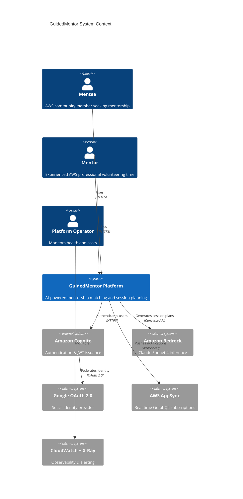
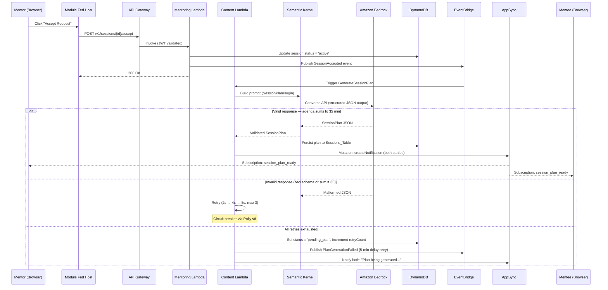
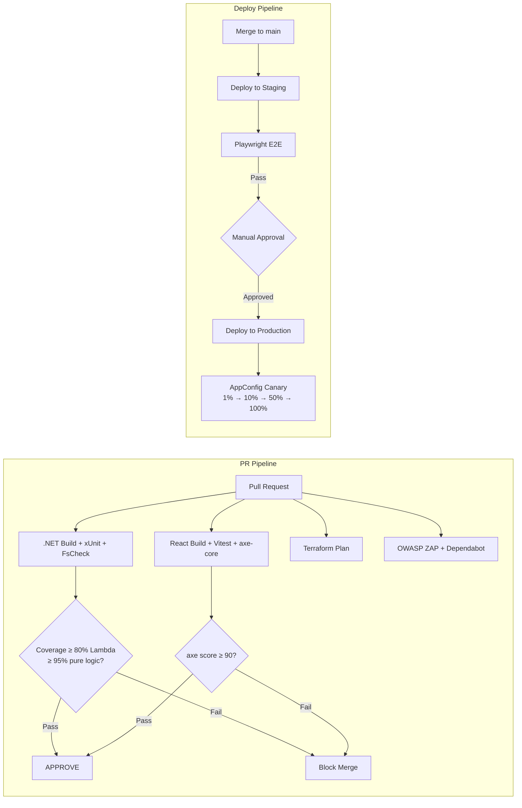
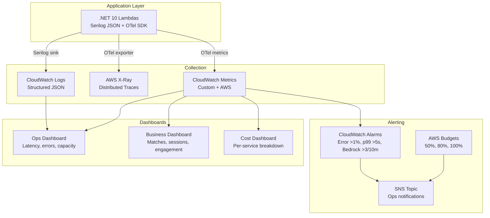

# Design Document: AWS Community GuidedMentor Platform

## Overview

GuidedMentor is an AI-powered mentorship platform for AWS Community Builders and User Groups across Australia. It connects mentees seeking career guidance with experienced AWS professionals via a rule-based compatibility algorithm (0-100 score across 4 dimensions) and generates personalised 35-minute session plans via Claude Sonnet 4 on Amazon Bedrock (direct inference only — no RAG, no knowledge bases). The system follows Domain-Driven Design with 4 bounded contexts, each implemented as a separate .NET 10 microservice (Native AOT Lambda), a separate Terraform module, and a separate Module Federation React micro-frontend.

### Key Design Decisions

| Decision | Choice | Rationale |
|----------|--------|-----------|
| Backend | .NET 10 (C#) + ASP.NET Minimal APIs + Native AOT Lambda | Sub-100ms cold starts, strong typing, cross-platform, LTS support |
| Frontend | React 19.2 + TypeScript + TailwindCSS 4 + Vite 6 + React Compiler | Auto-memoization, fast builds, desktop-only (min 1024px) |
| Frontend architecture | Module Federation (micro-frontends per bounded context) | Independent deployability, team autonomy, DDD alignment |
| AI SDK (frontend) | Vercel AI SDK 6 (useChat, useObject) | Streaming support, React hooks integration, structured objects |
| AI SDK (backend) | Microsoft.Extensions.AI (IChatClient) + Semantic Kernel plugins | Abstracted AI interface, testable via DI, prompt templating |
| AI model | Claude Sonnet 4 via Bedrock Converse API (direct inference) | Structured output, no RAG overhead, cost-effective |
| Architecture | API-first (OpenAPI 3.1), DDD, CQRS (MediatR), Clean Architecture | Separation of concerns, testability, scalability |
| Database (app) | DynamoDB (5 tables, on-demand) | Serverless, single-digit ms latency, conditional writes for locking |
| Database (analytics) | Aurora PostgreSQL Serverless v2 | Cross-entity joins, complex reporting, auto-scaling |
| Real-time | AWS AppSync GraphQL subscriptions | Managed WebSocket, Cognito auth integration |
| Auth | Amazon Cognito (Google OAuth + email/password) | Managed user pool, JWT 15-min access + 7-day refresh |
| IaC | Terraform (modules per bounded context, workspaces) | Multi-environment, remote state, team-level module ownership |
| CI/CD | GitHub Actions reusable workflows | Composable pipelines, built-in secret management |
| Observability | Serilog + OpenTelemetry + CloudWatch + X-Ray | Structured logs, distributed traces, cost-tagged metrics |
| Resilience | Polly v8 (circuit breaker, retry, timeout) | .NET native, configurable policies per dependency |
| Design system | AWS-Inspired dark theme with glassmorphism | Professional, on-brand, accessible (WCAG 2.1 AA) |
| Testing | xUnit + FsCheck (PBT) + Playwright (E2E) + axe-core (a11y) | Comprehensive pyramid with property-based correctness guarantees |

### System Context (C4 Level 1)



---

## Architecture

### High-Level Architecture (C4 Level 2 — Container Diagram)

```mermaid
graph TB
    subgraph "Frontend — CloudFront + S3"
        HOST[Module Federation Host Shell<br/>Routing, Auth Context, NavBar, Role Toggle]
        MF_ID[Remote: Identity<br/>Login, Signup, Onboarding, Settings]
        MF_MENT[Remote: Mentoring<br/>Browse, Mentor Cards, Locking, Sessions]
        MF_CONT[Remote: Content<br/>Session Plans, AI Streaming]
        MF_ENG[Remote: Engagement<br/>Notifications, AI Help, Tour, Dashboards]
    end

    subgraph "API Layer"
        APIGW[Amazon API Gateway<br/>REST /v1/ + Cognito JWT Authorizer]
        APPSYNC[AWS AppSync<br/>GraphQL Subscriptions]
    end

    subgraph "Compute — .NET 10 Native AOT Lambdas"
        subgraph "Identity Context"
            AUTH_FN[Auth Handlers]
            ROLE_FN[Role Toggle Handler]
            ONBOARD_FN[Onboarding Handlers]
        end
        subgraph "Mentoring Context"
            MATCH_FN[Matching Engine]
            LOCK_FN[Locking Mechanism]
            SESSION_FN[Session Handlers]
            COMPLETE_FN[Completion Flow]
        end
        subgraph "Content Context"
            PLAN_FN[Session Plan Generator<br/>Semantic Kernel + IChatClient]
        end
        subgraph "Engagement Context"
            NOTIFY_FN[Notification Handlers]
            HELP_FN[AI Help Assistant Handler]
            TOUR_FN[Onboarding Tour Handler]
            DASH_FN[Dashboard Handlers]
        end
    end

    subgraph "Data Layer"
        DDB[(DynamoDB<br/>5 Tables, On-Demand)]
        AURORA[(Aurora PostgreSQL<br/>Serverless v2)]
        S3[(S3 — Resume Storage<br/>+ SPA Assets)]
    end

    subgraph "AI Layer"
        BEDROCK[Amazon Bedrock<br/>Claude Sonnet 4<br/>Converse API]
    end

    subgraph "Event & Scheduling"
        EB[Amazon EventBridge<br/>Event Bus + Scheduler]
        DDB_STREAMS[DynamoDB Streams]
        DLQ[SQS Dead Letter Queues]
    end

    HOST --> MF_ID & MF_MENT & MF_CONT & MF_ENG
    HOST --> APIGW
    HOST --> APPSYNC
    APIGW --> AUTH_FN & ROLE_FN & ONBOARD_FN & MATCH_FN & LOCK_FN & SESSION_FN & COMPLETE_FN & PLAN_FN & NOTIFY_FN & HELP_FN & DASH_FN
    PLAN_FN --> BEDROCK
    HELP_FN --> BEDROCK
    AUTH_FN & ROLE_FN & ONBOARD_FN --> DDB
    MATCH_FN & LOCK_FN & SESSION_FN & COMPLETE_FN --> DDB
    PLAN_FN --> DDB
    NOTIFY_FN & DASH_FN --> DDB
    ONBOARD_FN --> S3
    DDB_STREAMS --> EB
    EB --> NOTIFY_FN & DLQ
    DDB_STREAMS --> AURORA
```



### Clean Architecture (Per Microservice)

Each bounded context microservice follows 4 layers:

```
┌─────────────────────────────────────────────────┐
│  Presentation (Lambda Handlers)                 │
│  - Request/Response DTOs                        │
│  - Minimal API endpoints                        │
│  - OpenAPI spec generation                      │
├─────────────────────────────────────────────────┤
│  Application (Use Cases)                        │
│  - Commands & Queries (CQRS via MediatR)        │
│  - Handlers                                     │
│  - Validators (FluentValidation)                │
│  - DTOs & Mapping                               │
├─────────────────────────────────────────────────┤
│  Domain (Business Logic)                        │
│  - Entities & Value Objects                     │
│  - Domain Events                                │
│  - Repository Interfaces                        │
│  - Domain Services                              │
├─────────────────────────────────────────────────┤
│  Infrastructure (External Concerns)             │
│  - DynamoDB Repositories                        │
│  - Bedrock Client (IChatClient)                 │
│  - S3 Client                                    │
│  - EventBridge Publisher                        │
│  - Serilog + OpenTelemetry config               │
└─────────────────────────────────────────────────┘
```

**Dependency rule:** Inner layers never reference outer layers. Domain has zero external dependencies.

### Deployment Architecture

| Component | AWS Service | Configuration |
|-----------|-------------|---------------|
| Frontend hosting | S3 + CloudFront | SPA assets, HTTPS only, OAI, cache invalidation on deploy |
| API | API Gateway (REST) | Regional, /v1/ prefix, Cognito authorizer, 100 req/min/user |
| Real-time | AppSync (GraphQL) | WebSocket subscriptions, Cognito auth |
| Compute | Lambda (.NET 10 Native AOT) | 256-512 MB, 30s timeout, multi-AZ |
| App database | DynamoDB (on-demand) | 5 tables, PITR enabled, AWS-managed KMS |
| Analytics DB | Aurora PostgreSQL Serverless v2 | Multi-AZ, 35-day backup retention |
| File storage | S3 | SSE-AES256, versioning, lifecycle to Glacier 30d |
| AI inference | Bedrock (Claude Sonnet 4) | ap-southeast-2, Converse API, structured output |
| Event bus | EventBridge | Rules per context, scheduler for cron jobs |
| Dead letters | SQS | Per-rule DLQ, 14-day retention |
| Feature flags | AWS AppConfig | Canary deployments (1% → 10% → 50% → 100%) |
| Secrets | AWS Secrets Manager | Rotated, retrieved at Lambda cold start |
| Monitoring | CloudWatch + X-Ray | Custom metrics, alarms, cost allocation tags |

---

## Components and Interfaces

### Bounded Context Decomposition


#### 1. Identity Context

**Responsibility:** Authentication, authorization, user profiles, role toggle, onboarding.

**Microservice:** `GuidedMentor.Identity.Api`

```csharp
// Domain Layer
public sealed record UserId(Guid Value);
public sealed record Email(string Value);

public sealed class User : Entity<UserId>
{
    public Email Email { get; private set; }
    public Role? ActiveRole { get; private set; }
    public string DisplayName { get; private set; }
    public string ProfilePhotoUrl { get; private set; }
    public AustralianChapter AwsChapter { get; private set; }
    public string City { get; private set; }
    public OnboardingStatus MentorOnboardingStatus { get; private set; }
    public OnboardingStatus MenteeOnboardingStatus { get; private set; }
    public int FailedLoginAttempts { get; private set; }
    public DateTime? LockedUntil { get; private set; }

    public void ToggleRole() { /* domain logic */ }
    public void IncrementFailedAttempts() { /* lockout after 5 in 15min */ }
    public void ResetFailedAttempts() { /* on successful login */ }
}

public enum Role { Mentor, Mentee }
public enum OnboardingStatus { NotStarted, InProgress, Completed }
public enum AustralianChapter 
{ 
    Sydney, Melbourne, Brisbane, Perth, Adelaide, Canberra, 
    Hobart, Darwin, GoldCoast, Newcastle, Wollongong, Geelong, Townsville 
}

// Application Layer — Commands (MediatR)
public sealed record SetRoleCommand(Guid UserId, Role Role) : IRequest<Result>;
public sealed record ToggleRoleCommand(Guid UserId) : IRequest<Result>;
public sealed record SaveOnboardingStepCommand(Guid UserId, Role Role, int Step, JsonDocument Data) : IRequest<Result>;

// Application Layer — Queries
public sealed record GetUserProfileQuery(Guid UserId) : IRequest<UserProfileDto>;
public sealed record GetOnboardingProgressQuery(Guid UserId, Role Role) : IRequest<OnboardingProgressDto>;
```

**API Endpoints (Identity Context):**

| Method | Path | Handler | Description |
|--------|------|---------|-------------|
| POST | /v1/auth/signup/google | GoogleOAuthHandler | Initiate Google OAuth signup |
| POST | /v1/auth/signup/email | EmailSignupHandler | Email/password signup |
| POST | /v1/auth/verify-email | VerifyEmailHandler | Verify email code |
| POST | /v1/auth/signin | SignInHandler | Sign in, issue JWT |
| POST | /v1/auth/signout | SignOutHandler | Invalidate tokens |
| POST | /v1/auth/refresh | RefreshTokenHandler | Refresh access token |
| POST | /v1/users/role | SetRoleHandler | Set initial role |
| POST | /v1/users/toggle-role | ToggleRoleHandler | Toggle active role |
| GET | /v1/users/me | GetProfileHandler | Get current user profile |
| PUT | /v1/users/me | UpdateProfileHandler | Update profile fields |
| POST | /v1/onboarding/step | SaveStepHandler | Save onboarding step |
| GET | /v1/onboarding/progress | GetProgressHandler | Get onboarding progress |
| POST | /v1/uploads/resume-url | GetPresignedUrlHandler | Get S3 upload URL |
| GET | /v1/uploads/resume/{userId} | GetDownloadUrlHandler | Get S3 download URL |
| PUT | /v1/settings/profile | UpdateSettingsHandler | Update settings |
| GET | /v1/health | HealthCheckHandler | Service health check |
| GET | /v1/admin/dashboard | GetAdminDashboardHandler | Platform health, user counts, alarm states |
| GET | /v1/admin/users | SearchUsersHandler | Search/filter all user accounts |
| PUT | /v1/admin/users/{id}/disable | DisableUserHandler | Disable user account (with reason) |
| PUT | /v1/admin/users/{id}/enable | EnableUserHandler | Re-enable user account (with reason) |
| POST | /v1/admin/maintenance | SetMaintenanceModeHandler | Toggle maintenance mode |
| PUT | /v1/admin/features/{name} | ToggleFeatureHandler | Enable/disable feature flag |
| GET | /v1/admin/audit-log | GetAuditLogHandler | View audit log entries |

#### 2. Mentoring Context

**Responsibility:** Matching algorithm, browse, locking mechanism, sessions, completion flow.

**Microservice:** `GuidedMentor.Mentoring.Api`

```csharp
// Domain Layer
public sealed class CompatibilityScore : ValueObject
{
    public int Total { get; }          // 0-100
    public int ChapterScore { get; }   // 0-30
    public int SkillsOverlap { get; }  // 0-30
    public int GoalAlignment { get; }  // 0-25
    public int ExperienceGap { get; }  // 0-15

    public static CompatibilityScore Compute(MenteeProfile mentee, MentorProfile mentor)
    {
        // Pure function — deterministic, no side effects
    }
}

public sealed class MentorLock : Entity<LockId>
{
    public MenteeId MenteeId { get; }
    public MentorId MentorId { get; }
    public DateTime ExpiresAt { get; }  // 15 minutes from creation
    public bool IsExpired => DateTime.UtcNow > ExpiresAt;
}

public sealed class Session : AggregateRoot<SessionId>
{
    public SessionStatus Status { get; private set; }
    public SessionPlan? Plan { get; private set; }
    public DateTime? MenteeCompletedAt { get; private set; }
    public DateTime? MentorCompletedAt { get; private set; }

    public Result MarkComplete(Role role) { /* completion state machine */ }
    public Result AttachPlan(SessionPlan plan) { /* validate and attach */ }
}

public enum SessionStatus 
{ 
    PendingAcceptance, PendingPlan, Active, 
    MenteeCompleted, Completed, Unresolved 
}

// Application Layer — Commands
public sealed record AcquireLockCommand(Guid MenteeId, Guid MentorId) : IRequest<LockResult>;
public sealed record ReleaseLockCommand(Guid LockId, Guid MenteeId) : IRequest<Result>;
public sealed record ConfirmSelectionCommand(Guid LockId, Guid MenteeId, Guid MentorId) : IRequest<Result>;
public sealed record AcceptRequestCommand(Guid SessionId, Guid MentorId) : IRequest<Result>;
public sealed record DeclineRequestCommand(Guid SessionId, Guid MentorId) : IRequest<Result>;
public sealed record MarkCompleteCommand(Guid SessionId, Guid UserId, Role Role) : IRequest<Result>;
public sealed record UpdateChecklistCommand(Guid SessionId, ChecklistUpdate Update) : IRequest<Result>;

// Application Layer — Queries
public sealed record BrowseMentorsQuery(Guid MenteeId, int Page, int PageSize = 12) : IRequest<PagedResult<MentorScoreDto>>;
public sealed record GetSessionPlanQuery(Guid SessionId) : IRequest<SessionPlanDto>;
```

**API Endpoints (Mentoring Context):**

| Method | Path | Handler | Description |
|--------|------|---------|-------------|
| GET | /v1/mentors/browse | BrowseMentorsHandler | Browse with compatibility scores |
| POST | /v1/mentors/lock | AcquireLockHandler | Acquire 15-min mentor lock |
| DELETE | /v1/mentors/lock/{lockId} | ReleaseLockHandler | Release lock |
| POST | /v1/mentors/lock/{lockId}/confirm | ConfirmSelectionHandler | Confirm selection |
| POST | /v1/sessions/{id}/accept | AcceptRequestHandler | Mentor accepts |
| POST | /v1/sessions/{id}/decline | DeclineRequestHandler | Mentor declines |
| GET | /v1/sessions/{id}/plan | GetSessionPlanHandler | Get session plan |
| POST | /v1/sessions/{id}/complete | MarkCompleteHandler | Mark session complete |
| PUT | /v1/sessions/{id}/checklist | UpdateChecklistHandler | Toggle checklist item |
| GET | /v1/health | HealthCheckHandler | Service health check |

#### 3. Content Context

**Responsibility:** Session plan generation via Bedrock, prompt templates, response validation.

**Microservice:** `GuidedMentor.Content.Api`

```csharp
// Domain Layer
public sealed record SessionPlan
{
    public string SessionTitle { get; init; }      // max 100 chars
    public IReadOnlyList<AgendaItem> Agenda { get; init; }  // 3-7 items, sum = 35 min
    public IReadOnlyList<string> PreworkTasks { get; init; }  // 2-5 items
    public IReadOnlyList<string> FollowUpTasks { get; init; } // 2-5 items

    public bool IsValid() => Agenda.Sum(a => a.DurationMinutes) == 35
                          && Agenda.Count is >= 3 and <= 7
                          && Agenda.All(a => a.DurationMinutes >= 3);
}

public sealed record AgendaItem(string Title, int DurationMinutes, string Description);

// Application Layer
public sealed record GenerateSessionPlanCommand(
    Guid SessionId, 
    MenteeProfileDto MenteeProfile, 
    MentorProfileDto MentorProfile
) : IRequest<Result<SessionPlan>>;

// Infrastructure — Semantic Kernel Plugin
[KernelPlugin(Name = "SessionPlanPlugin")]
public sealed class SessionPlanPlugin
{
    [KernelFunction("GeneratePlan")]
    public async Task<SessionPlan> GeneratePlanAsync(
        IChatClient chatClient,
        MenteeProfileDto mentee,
        MentorProfileDto mentor,
        CancellationToken ct = default)
    {
        // Build prompt from templates
        // Call Bedrock via IChatClient
        // Parse structured JSON output
        // Validate agenda sum = 35 min
    }
}
```

**API Endpoints (Content Context):**

| Method | Path | Handler | Description |
|--------|------|---------|-------------|
| POST | /v1/sessions/{id}/generate-plan | GeneratePlanHandler | Trigger plan generation |
| GET | /v1/sessions/{id}/plan/stream | StreamPlanHandler | SSE stream for useObject() |
| GET | /v1/health | HealthCheckHandler | Service health check |

#### 4. Engagement Context

**Responsibility:** Notifications, AI help assistant, onboarding tour, dashboards.

**Microservice:** `GuidedMentor.Engagement.Api`

```csharp
// Domain Layer
public sealed class Notification : Entity<NotificationId>
{
    public UserId RecipientUserId { get; }
    public NotificationType Type { get; }
    public string Message { get; }        // max 500 chars
    public string ActionUrl { get; }
    public bool IsRead { get; private set; }
    public DateTime CreatedAt { get; }

    public void MarkAsRead() => IsRead = true;
}

public enum NotificationType
{
    RequestSent, RequestAccepted, RequestDeclined,
    SessionPlanReady, CompletionMarked, Reminder
}

// Application Layer — Commands
public sealed record CreateNotificationCommand(Guid RecipientUserId, NotificationType Type, string Message, string ActionUrl) : IRequest<Result>;
public sealed record MarkNotificationReadCommand(Guid NotificationId) : IRequest<Result>;
public sealed record BatchMarkReadCommand(Guid UserId) : IRequest<Result>;
public sealed record ChatWithAssistantCommand(Guid UserId, string Message, IReadOnlyList<ChatMessage> History) : IRequest<StreamResult>;

// Application Layer — Queries
public sealed record GetNotificationsQuery(Guid UserId, int Limit = 50) : IRequest<IReadOnlyList<NotificationDto>>;
public sealed record GetUnreadCountQuery(Guid UserId) : IRequest<int>;
public sealed record GetMenteeDashboardQuery(Guid UserId) : IRequest<MenteeDashboardDto>;
public sealed record GetMentorDashboardQuery(Guid UserId) : IRequest<MentorDashboardDto>;
```

**API Endpoints (Engagement Context):**

| Method | Path | Handler | Description |
|--------|------|---------|-------------|
| GET | /v1/notifications | GetNotificationsHandler | Last 50 notifications |
| PUT | /v1/notifications/{id}/read | MarkReadHandler | Mark single read |
| PUT | /v1/notifications/read-all | BatchMarkReadHandler | Mark all read |
| GET | /v1/notifications/count | GetUnreadCountHandler | Unread badge count |
| POST | /v1/assistant/chat | ChatHandler | AI help assistant (streaming) |
| GET | /v1/dashboard/mentee | MenteeDashboardHandler | Mentee dashboard data |
| GET | /v1/dashboard/mentor | MentorDashboardHandler | Mentor dashboard data |
| GET | /v1/tour/status | GetTourStatusHandler | Onboarding tour state |
| PUT | /v1/tour/dismiss | DismissTourHandler | Dismiss tour |
| GET | /v1/health | HealthCheckHandler | Service health check |

### Cross-Cutting Concerns

**Structured Error Response (all contexts):**

```json
{
  "statusCode": 400,
  "error": "ValidationError",
  "message": "One or more validation errors occurred.",
  "correlationId": "550e8400-e29b-41d4-a716-446655440000",
  "fieldErrors": {
    "email": "Email format is invalid",
    "password": "Password must be at least 12 characters"
  }
}
```

**Request Pipeline (per Lambda):**

```
Request → JWT Validation → Rate Limit Check → Input Validation (FluentValidation) 
→ MediatR Handler → Domain Logic → Repository → Response
```

---

## Data Models

### DynamoDB Table Schemas (8 Tables)

> **Note:** The original 5 tables (Users, Mentors, Mentees, Sessions, Notifications) remain unchanged. 3 new tables have been added: Jobs, Meetups, and EngagementEvents (see sections below for Requirements 28, 29, 30). The Mentors table now includes availability fields (availabilityStatus, unavailabilityReason, returnDate, unavailableSince) — see Mentor Availability Toggle section for details.

#### Users Table

| Attribute | Type | Key | Constraints |
|-----------|------|-----|-------------|
| userId | String (UUID) | PK | Cognito sub |
| email | String | GSI-Email-PK | Unique |
| activeRole | String | — | 'mentor' \| 'mentee' \| null |
| displayName | String | — | 2-100 chars |
| profilePhotoUrl | String | — | S3 URL |
| awsChapter | String | — | From AustralianChapters enum |
| city | String | — | City name |
| mentorOnboardingStatus | String | — | not_started \| in_progress \| completed |
| menteeOnboardingStatus | String | — | not_started \| in_progress \| completed |
| failedLoginAttempts | Number | — | 0-5 |
| lockedUntil | String | — | ISO 8601 timestamp or null |
| createdAt | String | — | ISO 8601 |
| updatedAt | String | — | ISO 8601 |

**GSI-Email:** PK=email — Login lookups.

#### Mentors Table

| Attribute | Type | Key | Constraints |
|-----------|------|-----|-------------|
| mentorId | String (UUID) | PK | — |
| userId | String (UUID) | GSI-UserId-PK | FK to Users |
| expertiseAreas | List\<String\> | — | 1-10 items |
| certifications | List\<String\> | — | 0-15 items |
| topics | List\<String\> | — | 1-10 items |
| yearsOfExperience | Number | — | 1-30 |
| maxMentees | Number | — | 1-5 |
| activeMenteeCount | Number | — | 0 to maxMentees |
| availability | Map | — | DayOfWeek → TimeSlot[] |
| sessionFormats | List\<String\> | — | video_call, voice_call, chat |
| professionalTitle | String | — | 2-100 chars |
| companyName | String | — | 2-100 chars |
| bio | String | — | 100-1000 chars |
| onboardingStatus | String | — | not_started \| in_progress \| completed |
| isAvailable | Boolean | — | Computed: activeMenteeCount < maxMentees |
| createdAt | String | — | ISO 8601 |
| updatedAt | String | — | ISO 8601 |

**GSI-UserId:** PK=userId — Profile lookup from auth context.
**GSI-Available:** PK=isAvailable, SK=activeMenteeCount — Browse available mentors.

#### Mentees Table

| Attribute | Type | Key | Constraints |
|-----------|------|-----|-------------|
| menteeId | String (UUID) | PK | — |
| userId | String (UUID) | GSI-UserId-PK | FK to Users |
| skills | List\<String\> | — | 1-10 items |
| experienceLevel | String | — | beginner \| intermediate \| advanced |
| yearsOfExperience | Number | — | 0-50 |
| primaryGoal | String | — | career_transition \| skill_development \| certification_preparation \| project_guidance |
| goalDescription | String | — | 50-500 chars |
| preferredDuration | String | — | 4_weeks \| 8_weeks \| 12_weeks |
| availability | Map | — | DayOfWeek → TimeSlot[] |
| communicationPreference | String | — | video_call \| voice_call \| chat |
| resumeUrl | String | — | S3 key (optional) |
| onboardingStatus | String | — | not_started \| in_progress \| completed |
| currentLockId | String | — | Active lock ID or null |
| createdAt | String | — | ISO 8601 |
| updatedAt | String | — | ISO 8601 |

**GSI-UserId:** PK=userId — Profile lookup from auth context.

#### Sessions Table

| Attribute | Type | Key | Constraints |
|-----------|------|-----|-------------|
| sessionId | String (UUID) | PK | — |
| menteeId | String (UUID) | GSI-Mentee-PK | FK to Mentees |
| mentorId | String (UUID) | GSI-Mentor-PK | FK to Mentors |
| status | String | — | pending_acceptance \| pending_plan \| active \| mentee_completed \| completed \| unresolved |
| sessionPlan | Map | — | JSON (max 50KB) |
| checklistState | Map | — | { prework: bool[], followup: bool[] } |
| menteeCompletedAt | String | — | ISO 8601 or null |
| mentorCompletedAt | String | — | ISO 8601 or null |
| lockId | String | — | Associated lock ID |
| lockExpiresAt | String | — | ISO 8601, TTL attribute |
| planRetryCount | Number | — | 0-3 |
| createdAt | String | GSI-Mentee-SK, GSI-Mentor-SK | ISO 8601 |
| updatedAt | String | — | ISO 8601 |

**GSI-Mentee:** PK=menteeId, SK=createdAt — Mentee's sessions by date.
**GSI-Mentor:** PK=mentorId, SK=createdAt — Mentor's sessions by date.

#### Notifications Table

| Attribute | Type | Key | Constraints |
|-----------|------|-----|-------------|
| notificationId | String (UUID) | PK | — |
| recipientUserId | String (UUID) | GSI-Recipient-PK | Target user |
| type | String | — | NotificationType enum |
| message | String | — | Max 500 chars |
| relatedSessionId | String | — | FK to Sessions (optional) |
| actionUrl | String | — | Deep link to relevant page |
| isRead | Boolean | — | Default false |
| createdAt | String | GSI-Recipient-SK | ISO 8601 |

**GSI-Recipient:** PK=recipientUserId, SK=createdAt — User's notifications in reverse chronological order.

### DynamoDB Locking Strategy

Locks are implemented via conditional writes on a dedicated lock record pattern within the Sessions table:

```
ConditionExpression: "attribute_not_exists(lockId) OR lockExpiresAt < :now"
```

This atomic conditional write prevents race conditions where two mentees attempt to lock the same mentor simultaneously. The `lockExpiresAt` attribute uses DynamoDB TTL for automatic expiration cleanup.

### Aurora PostgreSQL Schema (Analytics)

```sql
-- Denormalised reporting tables (replicated from DynamoDB via Streams + Lambda)

CREATE TABLE analytics.matches (
    match_id UUID PRIMARY KEY,
    mentee_id UUID NOT NULL,
    mentor_id UUID NOT NULL,
    compatibility_score INTEGER NOT NULL CHECK (compatibility_score BETWEEN 0 AND 100),
    chapter_score INTEGER NOT NULL,
    skills_overlap INTEGER NOT NULL,
    goal_alignment INTEGER NOT NULL,
    experience_gap INTEGER NOT NULL,
    mentee_chapter VARCHAR(50) NOT NULL,
    mentor_chapter VARCHAR(50) NOT NULL,
    created_at TIMESTAMP WITH TIME ZONE DEFAULT NOW()
);

CREATE TABLE analytics.sessions (
    session_id UUID PRIMARY KEY,
    mentee_id UUID NOT NULL,
    mentor_id UUID NOT NULL,
    status VARCHAR(30) NOT NULL,
    plan_generated_at TIMESTAMP WITH TIME ZONE,
    mentee_completed_at TIMESTAMP WITH TIME ZONE,
    mentor_completed_at TIMESTAMP WITH TIME ZONE,
    plan_retry_count INTEGER DEFAULT 0,
    checklist_total INTEGER DEFAULT 0,
    checklist_completed INTEGER DEFAULT 0,
    created_at TIMESTAMP WITH TIME ZONE DEFAULT NOW(),
    updated_at TIMESTAMP WITH TIME ZONE DEFAULT NOW()
);

CREATE TABLE analytics.users (
    user_id UUID PRIMARY KEY,
    email VARCHAR(255) NOT NULL,
    active_role VARCHAR(10),
    aws_chapter VARCHAR(50),
    city VARCHAR(100),
    mentor_onboarding_completed BOOLEAN DEFAULT FALSE,
    mentee_onboarding_completed BOOLEAN DEFAULT FALSE,
    created_at TIMESTAMP WITH TIME ZONE DEFAULT NOW()
);

CREATE TABLE analytics.engagement_metrics (
    metric_id UUID PRIMARY KEY,
    user_id UUID NOT NULL,
    event_type VARCHAR(50) NOT NULL,
    metadata JSONB,
    occurred_at TIMESTAMP WITH TIME ZONE DEFAULT NOW()
);

-- Indexes for reporting queries
CREATE INDEX idx_sessions_status ON analytics.sessions(status);
CREATE INDEX idx_sessions_mentor ON analytics.sessions(mentor_id, created_at DESC);
CREATE INDEX idx_sessions_mentee ON analytics.sessions(mentee_id, created_at DESC);
CREATE INDEX idx_matches_chapter ON analytics.matches(mentee_chapter, mentor_chapter);
CREATE INDEX idx_engagement_user ON analytics.engagement_metrics(user_id, occurred_at DESC);

-- Reporting views
CREATE VIEW analytics.match_success_rates AS
SELECT 
    mentee_chapter,
    COUNT(*) as total_matches,
    COUNT(*) FILTER (WHERE status = 'completed') as completed,
    ROUND(COUNT(*) FILTER (WHERE status = 'completed')::NUMERIC / NULLIF(COUNT(*), 0) * 100, 1) as success_rate
FROM analytics.matches m
JOIN analytics.sessions s ON m.mentee_id = s.mentee_id AND m.mentor_id = s.mentor_id
GROUP BY mentee_chapter;

CREATE VIEW analytics.mentor_utilisation AS
SELECT 
    u.user_id,
    u.aws_chapter,
    COUNT(DISTINCT s.session_id) as total_sessions,
    COUNT(DISTINCT s.session_id) FILTER (WHERE s.status = 'active') as active_sessions,
    COUNT(DISTINCT s.session_id) FILTER (WHERE s.status = 'completed') as completed_sessions
FROM analytics.users u
LEFT JOIN analytics.sessions s ON u.user_id = s.mentor_id
WHERE u.active_role = 'mentor'
GROUP BY u.user_id, u.aws_chapter;
```

### RDS Proxy Configuration

```hcl
# Terraform — RDS Proxy for Lambda → Aurora connection pooling
resource "aws_db_proxy" "analytics" {
  name                   = "guidedmentor-analytics-proxy"
  debug_logging          = false
  engine_family          = "POSTGRESQL"
  idle_client_timeout    = 300  # 5 minutes
  require_tls            = true
  role_arn               = aws_iam_role.rds_proxy.arn
  vpc_security_group_ids = [aws_security_group.rds_proxy.id]
  vpc_subnet_ids         = var.private_subnet_ids

  auth {
    auth_scheme = "SECRETS"
    iam_auth    = "REQUIRED"
    secret_arn  = aws_secretsmanager_secret.aurora_credentials.arn
  }
}

resource "aws_db_proxy_default_target_group" "analytics" {
  db_proxy_name = aws_db_proxy.analytics.name

  connection_pool_config {
    max_connections_percent      = 80  # 80% of Aurora max_connections
    max_idle_connections_percent = 20
    connection_borrow_timeout    = 120  # seconds
  }
}
```

---

### Matching Algorithm — Detailed Design


The matching algorithm is a pure function computing a 0-100 compatibility score between a mentee and each available mentor across four weighted dimensions.

#### Pseudocode

```csharp
public static class MatchingEngine
{
    /// <summary>
    /// Computes compatibility score (0-100) between mentee and mentor.
    /// Pure function — no side effects, fully deterministic.
    /// </summary>
    public static CompatibilityScore Compute(MenteeProfile mentee, MentorProfile mentor)
    {
        int chapterScore = ComputeChapterScore(mentee.AwsChapter, mentor.AwsChapter);
        int skillsOverlap = ComputeSkillsScore(mentee.Skills, mentor.ExpertiseAreas);
        int goalAlignment = ComputeGoalScore(mentee.PrimaryGoal, mentor.Topics);
        int experienceGap = ComputeExperienceScore(mentee.YearsOfExperience, mentor.YearsOfExperience);

        int total = Math.Min(chapterScore + skillsOverlap + goalAlignment + experienceGap, 100);

        return new CompatibilityScore(total, chapterScore, skillsOverlap, goalAlignment, experienceGap);
    }

    /// <summary>
    /// Chapter scoring: +30 same chapter, +15 same city different chapter, +0 otherwise.
    /// </summary>
    public static int ComputeChapterScore(AustralianChapter menteeChapter, AustralianChapter mentorChapter)
    {
        if (menteeChapter == mentorChapter) return 30;
        if (GetCity(menteeChapter) == GetCity(mentorChapter)) return 15;
        return 0;
    }

    /// <summary>
    /// Skills overlap: round((overlap / menteeSkillsCount) * 30).
    /// Returns 0 if mentee has no skills.
    /// </summary>
    public static int ComputeSkillsScore(IReadOnlyList<string> menteeSkills, IReadOnlyList<string> mentorExpertise)
    {
        if (menteeSkills.Count == 0) return 0;
        int overlap = menteeSkills.Count(s => mentorExpertise.Contains(s, StringComparer.OrdinalIgnoreCase));
        return (int)Math.Round((double)overlap / menteeSkills.Count * 30);
    }

    /// <summary>
    /// Goal-topic alignment: round((matchingTopics / totalGoalTopics) * 25).
    /// Returns 0 if mentee has no primary goal.
    /// </summary>
    public static int ComputeGoalScore(PrimaryGoal? menteeGoal, IReadOnlyList<string> mentorTopics)
    {
        if (menteeGoal is null) return 0;

        var goalTopicMap = new Dictionary<PrimaryGoal, string[]>
        {
            [PrimaryGoal.CareerTransition] = ["career guidance", "interview prep", "resume review"],
            [PrimaryGoal.SkillDevelopment] = ["hands-on labs", "code review", "architecture"],
            [PrimaryGoal.CertificationPreparation] = ["certification study", "exam prep", "practice tests"],
            [PrimaryGoal.ProjectGuidance] = ["project planning", "code review", "architecture"],
        };

        if (!goalTopicMap.TryGetValue(menteeGoal.Value, out var relatedTopics)) return 0;
        
        int matches = relatedTopics.Count(t => mentorTopics.Contains(t, StringComparer.OrdinalIgnoreCase));
        return (int)Math.Round((double)matches / relatedTopics.Length * 25);
    }

    /// <summary>
    /// Experience gap: +15 if mentor ≥2 more years, +10 if exactly 1 more,
    /// +5 if equal, +0 if mentee has more.
    /// </summary>
    public static int ComputeExperienceScore(int menteeYears, int mentorYears)
    {
        int gap = mentorYears - menteeYears;
        return gap switch
        {
            >= 2 => 15,
            1 => 10,
            0 => 5,
            _ => 0
        };
    }

    /// <summary>
    /// Browse page: compute all scores, sort descending (alpha for ties), paginate.
    /// </summary>
    public static PagedResult<MentorScoreDto> GetBrowseResults(
        MenteeProfile mentee, 
        IReadOnlyList<MentorProfile> availableMentors,
        int page = 1, 
        int pageSize = 12)
    {
        var scores = availableMentors
            .Select(m => new MentorScoreDto(m, Compute(mentee, m)))
            .OrderByDescending(s => s.Score.Total)
            .ThenBy(s => s.Mentor.DisplayName, StringComparer.OrdinalIgnoreCase)
            .ToList();

        return new PagedResult<MentorScoreDto>(
            Items: scores.Skip((page - 1) * pageSize).Take(pageSize).ToList(),
            TotalCount: scores.Count,
            Page: page,
            PageSize: pageSize
        );
    }
}
```

#### Complexity Analysis

- **Time:** O(M × S) where M = available mentors, S = max skills (≤10). Effectively O(M).
- **Space:** O(M) for storing scored results before pagination.
- **Latency target:** < 3 seconds including DynamoDB reads. With typical pool < 500 mentors and on-demand capacity, well within target.

### Session Plan Generation Flow



### Module Federation Architecture

```mermaid
graph TB
    subgraph "Host Shell (port 3000)"
        SHELL[Shell App<br/>Routes, Auth Provider, NavBar, Role Toggle, NotificationBell]
        ROUTER[React Router v7<br/>Lazy-loaded remotes]
    end

    subgraph "Remote: Identity (port 3001)"
        ID_LOGIN[LoginPage]
        ID_SIGNUP[SignupPage]
        ID_ONBOARD[OnboardingWizard<br/>4-step mentee / 3-step mentor]
        ID_SETTINGS[SettingsPage]
    end

    subgraph "Remote: Mentoring (port 3002)"
        MENT_BROWSE[BrowsePage<br/>Mentor cards + scores]
        MENT_LOCK[LockConfirmModal]
        MENT_SESSION[SessionListPage]
    end

    subgraph "Remote: Content (port 3003)"
        CONT_PLAN[SessionPlanPage<br/>useObject() streaming]
        CONT_CHECKLIST[ChecklistComponent]
    end

    subgraph "Remote: Engagement (port 3004)"
        ENG_NOTIF[NotificationPanel]
        ENG_HELP[AIHelpAssistant<br/>useChat() streaming]
        ENG_TOUR[OnboardingTour<br/>Step overlays]
        ENG_DASH[DashboardPages<br/>Mentee + Mentor]
    end

    SHELL --> ROUTER
    ROUTER -->|/login, /signup| ID_LOGIN & ID_SIGNUP
    ROUTER -->|/onboarding| ID_ONBOARD
    ROUTER -->|/settings| ID_SETTINGS
    ROUTER -->|/browse| MENT_BROWSE
    ROUTER -->|/sessions| MENT_SESSION
    ROUTER -->|/sessions/:id| CONT_PLAN
    ROUTER -->|/dashboard| ENG_DASH
    SHELL --> ENG_NOTIF & ENG_HELP & ENG_TOUR
```

**Module Federation Config (vite.config.ts — Host):**

```typescript
// Host shell — vite.config.ts
import federation from '@originjs/vite-plugin-federation';

export default defineConfig({
  plugins: [
    react(),
    federation({
      name: 'host',
      remotes: {
        identity: 'http://localhost:3001/assets/remoteEntry.js',
        mentoring: 'http://localhost:3002/assets/remoteEntry.js',
        content: 'http://localhost:3003/assets/remoteEntry.js',
        engagement: 'http://localhost:3004/assets/remoteEntry.js',
      },
      shared: ['react', 'react-dom', 'react-router-dom', '@tanstack/react-query'],
    }),
  ],
});
```

### Terraform Module Structure

```
infrastructure/
├── modules/
│   ├── identity/
│   │   ├── main.tf          # Cognito User Pool, Users Table, auth Lambdas
│   │   ├── variables.tf
│   │   ├── outputs.tf
│   │   └── lambda.tf        # Identity context Lambda functions
│   ├── mentoring/
│   │   ├── main.tf          # Mentors, Mentees, Sessions, Jobs tables, matching Lambdas
│   │   ├── variables.tf
│   │   ├── outputs.tf
│   │   └── lambda.tf
│   ├── content/
│   │   ├── main.tf          # Bedrock access IAM, plan generation Lambda
│   │   ├── variables.tf
│   │   ├── outputs.tf
│   │   └── lambda.tf
│   ├── engagement/
│   │   ├── main.tf          # Notifications, Meetups, EngagementEvents tables, AppSync, dashboard Lambdas
│   │   ├── variables.tf
│   │   ├── outputs.tf
│   │   ├── appsync.tf       # GraphQL schema + resolvers
│   │   └── lambda.tf
│   ├── networking/
│   │   ├── main.tf          # API Gateway, CloudFront, S3 buckets
│   │   ├── api-gateway.tf   # REST API, Cognito authorizer, rate limiting
│   │   ├── cloudfront.tf    # SPA distribution + resume storage
│   │   └── outputs.tf
│   ├── analytics/
│   │   ├── main.tf          # Aurora PostgreSQL Serverless v2
│   │   ├── streams.tf       # DDB Streams → Lambda → Aurora replication
│   │   └── outputs.tf
│   └── observability/
│       ├── main.tf          # CloudWatch dashboards, alarms, SNS
│       ├── alarms.tf        # Error rate, latency, Bedrock failures
│       ├── budgets.tf       # AWS Budget alerts (50%, 80%, 100%)
│       └── outputs.tf
├── environments/
│   ├── dev.tfvars
│   ├── staging.tfvars
│   └── prod.tfvars
├── backend.tf               # S3 remote state + DynamoDB lock table
├── main.tf                  # Module composition + provider config
├── variables.tf             # Shared variables
└── outputs.tf               # Top-level outputs
```

### CI/CD Pipeline Architecture



**GitHub Actions Workflow Files:**

```yaml
# .github/workflows/
├── ci-dotnet.yml           # Build, test (xUnit + FsCheck), lint, coverage
├── ci-react.yml            # Build, test (Vitest), lint, axe-core a11y
├── deploy-infrastructure.yml # Terraform plan (PR) / apply (merge)
├── deploy-backend.yml      # Native AOT publish → zip → Lambda deploy
├── deploy-frontend.yml     # Vite build → S3 upload → CloudFront invalidate
├── e2e-tests.yml           # Playwright against staging
└── security-scan.yml       # OWASP ZAP + NuGet Audit + npm audit
```

### Design System Tokens

```css
:root {
  /* AWS-Inspired Color Palette */
  --color-background: #0a1628;       /* AWS Dark Navy */
  --color-surface: #131a2e;          /* Card backgrounds */
  --color-surface-elevated: #1a2340; /* Elevated cards, modals */
  --color-primary: #FF9900;          /* AWS Orange — buttons, CTAs, active */
  --color-secondary: #00A3A1;        /* AWS Teal — mentee indicators */
  --color-accent: #8C4FFF;           /* AWS Purple — mentor indicators */
  --color-success: #2ECC71;          /* Match >80% */
  --color-warning: #F39C12;          /* Match 50-79% */
  --color-error: #E74C3C;            /* Errors, match <50% */
  --color-text-primary: #F8FAFC;
  --color-text-secondary: #94A3B8;
  --color-text-muted: #64748B;

  /* Glass Effect */
  --glass-bg: rgba(255, 255, 255, 0.05);
  --glass-bg-hover: rgba(255, 255, 255, 0.10);
  --glass-blur: blur(12px);
  --glass-border: 1px solid rgba(255, 255, 255, 0.08);

  /* Gradient Borders */
  --gradient-mentor: linear-gradient(135deg, #8C4FFF, #FF9900);
  --gradient-mentee: linear-gradient(135deg, #00A3A1, #FF9900);
  --gradient-surface: linear-gradient(135deg, rgba(255, 153, 0, 0.1), rgba(0, 163, 161, 0.1));

  /* Typography — Inter */
  --font-family-body: 'Inter', -apple-system, BlinkMacSystemFont, sans-serif;
  --font-family-heading: 'Inter', -apple-system, BlinkMacSystemFont, sans-serif;
  --font-size-xs: 0.75rem;    /* 12px */
  --font-size-sm: 0.875rem;   /* 14px */
  --font-size-base: 1rem;     /* 16px */
  --font-size-lg: 1.125rem;   /* 18px */
  --font-size-xl: 1.25rem;    /* 20px */
  --font-size-2xl: 1.5rem;    /* 24px */
  --font-size-3xl: 1.875rem;  /* 30px */
  --font-size-4xl: 2.25rem;   /* 36px */
  --font-weight-normal: 400;
  --font-weight-medium: 500;
  --font-weight-semibold: 600;
  --font-weight-bold: 700;

  /* Spacing — 4px base grid */
  --space-1: 4px;
  --space-2: 8px;
  --space-3: 12px;
  --space-4: 16px;
  --space-6: 24px;
  --space-8: 32px;
  --space-12: 48px;
  --space-16: 64px;

  /* Border Radius */
  --radius-sm: 6px;
  --radius-md: 12px;        /* Standard */
  --radius-lg: 16px;
  --radius-xl: 24px;
  --radius-full: 9999px;

  /* Shadows */
  --shadow-sm: 0 1px 3px rgba(0, 0, 0, 0.3);
  --shadow-md: 0 4px 12px rgba(0, 0, 0, 0.4);
  --shadow-lg: 0 8px 24px rgba(0, 0, 0, 0.5);
  --shadow-glow-orange: 0 0 20px rgba(255, 153, 0, 0.15);
  --shadow-glow-teal: 0 0 20px rgba(0, 163, 161, 0.15);
  --shadow-glow-purple: 0 0 20px rgba(140, 79, 255, 0.15);

  /* Transitions */
  --transition-fast: 150ms ease;
  --transition-base: 250ms ease;
  --transition-slow: 350ms ease;

  /* Z-index scale */
  --z-dropdown: 100;
  --z-sticky: 200;
  --z-modal-backdrop: 300;
  --z-modal: 400;
  --z-toast: 500;
  --z-help-assistant: 600;
  --z-tooltip: 700;
}

/* Glassmorphism utility classes */
.glass-card {
  background: var(--glass-bg);
  backdrop-filter: var(--glass-blur);
  -webkit-backdrop-filter: var(--glass-blur);
  border: var(--glass-border);
  border-radius: var(--radius-md);
}

/* Fallback for browsers without backdrop-filter */
@supports not (backdrop-filter: blur(12px)) {
  .glass-card {
    background: var(--color-surface);
    border: 1px solid rgba(255, 255, 255, 0.12);
  }
}

/* Reduced motion */
@media (prefers-reduced-motion: reduce) {
  *, *::before, *::after {
    animation-duration: 0.01ms !important;
    transition-duration: 0.01ms !important;
  }
}
```

### Frontend Component Architecture

```
src/
├── host-shell/
│   ├── App.tsx                  # Root layout, providers, router
│   ├── components/
│   │   ├── NavBar.tsx           # Top nav with role toggle, notification bell
│   │   ├── RoleToggle.tsx       # One-click role switch button
│   │   ├── NotificationBell.tsx # Badge count + dropdown
│   │   ├── SkipNavLink.tsx      # Accessibility skip-to-content
│   │   └── ErrorBoundary.tsx    # Module Federation error fallback
│   ├── providers/
│   │   ├── AuthProvider.tsx     # JWT state, refresh logic
│   │   ├── RoleProvider.tsx     # Active role context
│   │   ├── QueryProvider.tsx    # TanStack Query client
│   │   └── TrackerProvider.tsx  # Event tracking context provider
│   └── hooks/
│       ├── useAuth.ts
│       ├── useRole.ts
│       └── useTracker.ts        # Tracking hook for all components
├── remotes/
│   ├── identity/
│   │   ├── pages/LoginPage.tsx
│   │   ├── pages/SignupPage.tsx
│   │   ├── pages/OnboardingWizard.tsx
│   │   ├── pages/SettingsPage.tsx
│   │   └── components/...
│   ├── mentoring/
│   │   ├── pages/BrowsePage.tsx
│   │   ├── pages/SessionListPage.tsx
│   │   ├── pages/OpportunitiesPage.tsx     # Browse all jobs with filters
│   │   ├── components/MentorCard.tsx        # Score badge, expertise tags
│   │   ├── components/LockConfirmModal.tsx
│   │   ├── components/CompatibilityBadge.tsx # Color-coded percentage
│   │   ├── components/FilterPanel.tsx       # Chapter, skills filters
│   │   ├── components/JobPostingCard.tsx    # Job card with apply button
│   │   ├── components/HiringBadge.tsx       # Badge on mentor cards
│   │   └── components/JobPostingForm.tsx    # Create/edit job form
│   ├── content/
│   │   ├── pages/SessionPlanPage.tsx        # useObject() streaming
│   │   ├── components/AgendaTimeline.tsx
│   │   ├── components/Checklist.tsx         # Optimistic UI updates
│   │   └── components/ProgressBar.tsx
│   └── engagement/
│       ├── pages/MenteeDashboard.tsx
│       ├── pages/MentorDashboard.tsx
│       ├── components/AIHelpAssistant.tsx    # useChat() floating bubble
│       ├── components/OnboardingTour.tsx     # Step overlays
│       ├── components/NotificationPanel.tsx
│       ├── components/EmptyState.tsx
│       ├── components/MeetupCalendar.tsx     # Upcoming meetups display
│       ├── components/MeetupAlignModal.tsx   # Align session to meetup
│       ├── components/MeetupBadge.tsx        # "Attending [meetup]" badge
│       └── components/ConsentBanner.tsx      # Tracking consent opt-in/out
└── shared/
    ├── components/
    │   ├── Button.tsx
    │   ├── Input.tsx
    │   ├── Modal.tsx
    │   ├── Toast.tsx
    │   ├── Skeleton.tsx          # Loading skeletons
    │   ├── ConfirmDialog.tsx     # Destructive action confirmation
    │   └── ProgressIndicator.tsx
    ├── hooks/
    │   ├── useToast.ts
    │   ├── useOptimisticUpdate.ts
    │   └── useDebounce.ts        # 300ms for inline validation
    └── utils/
        ├── api-client.ts         # Generated from OpenAPI spec
        ├── token-manager.ts      # JWT refresh, storage
        └── a11y-helpers.ts       # Focus trap, aria-live announcements
```

### Observability Architecture



**Every log entry includes:**
- `correlationId` (X-Correlation-Id header, propagated across services)
- `userId` (from JWT claims)
- `requestPath`
- `duration` (ms)
- `service` (bounded context name)
- `environment` (dev/staging/prod)

**Custom CloudWatch Metrics:**
- `api/latency/{endpoint}` — p50, p95, p99
- `api/errors/{endpoint}` — count per 5-min window
- `bedrock/tokens/input` — per invocation
- `bedrock/tokens/output` — per invocation
- `bedrock/latency` — per invocation
- `matching/computation_time` — per browse request
- `dynamodb/consumed_capacity/{table}` — RCU/WCU

**Alarm Thresholds:**

| Alarm | Condition | Period | Action |
|-------|-----------|--------|--------|
| High Error Rate | errors > 1% | 5 minutes | SNS → PagerDuty |
| High Latency | p99 > 5000ms | 5 minutes | SNS |
| Bedrock Failures | failures > 3 | 10 minutes | SNS |
| DDB Throttled | throttled > 0 | 1 minute | SNS |
| Budget 80% | estimated > 80% monthly | Daily | SNS |

### Security Architecture

| Layer | Control | Implementation |
|-------|---------|----------------|
| Transport | TLS 1.3, HSTS | CloudFront + API Gateway enforced |
| Authentication | JWT (Cognito) | 15-min access + 7-day refresh tokens |
| Authorization | Resource-based | userId in JWT must match resource owner |
| Input validation | FluentValidation | Every endpoint, reject before processing |
| CSRF | SameSite=Strict + Origin check | Cookie policy + API validation |
| CSP | Content-Security-Policy header | CloudFront response headers policy |
| Secrets | AWS Secrets Manager | Retrieved at cold start, cached in-memory |
| Encryption at rest | KMS (DDB), AES-256 (S3), KMS (Aurora) | AWS-managed keys |
| Audit | CloudWatch audit log group | Every state change: userId, action, resource, correlationId |
| Dependency scanning | Dependabot + NuGet Audit + npm audit | CI blocking on high-severity |
| DAST | OWASP ZAP | CI blocking on high-severity findings |
| File upload | Pre-signed URLs (5-min expiry) | No file content through Lambda |
| Rate limiting | 100 req/min/user | API Gateway usage plan per Cognito sub |
| Account lockout | 5 failures in 15 min → 30-min lock | DynamoDB conditional write on counter |

### Resilience Patterns (Polly v8)

```csharp
// Resilience pipeline configuration per external dependency
services.AddResiliencePipeline("bedrock", builder =>
{
    builder
        .AddTimeout(TimeSpan.FromSeconds(30))
        .AddRetry(new RetryStrategyOptions
        {
            MaxRetryAttempts = 3,
            BackoffType = DelayBackoffType.Exponential,
            Delay = TimeSpan.FromSeconds(2),
            UseJitter = true,
        })
        .AddCircuitBreaker(new CircuitBreakerStrategyOptions
        {
            FailureRatio = 0.5,
            SamplingDuration = TimeSpan.FromSeconds(30),
            MinimumThroughput = 5,
            BreakDuration = TimeSpan.FromSeconds(60),
        });
});

services.AddResiliencePipeline("dynamodb", builder =>
{
    builder
        .AddTimeout(TimeSpan.FromSeconds(5))
        .AddRetry(new RetryStrategyOptions
        {
            MaxRetryAttempts = 3,
            BackoffType = DelayBackoffType.Exponential,
            Delay = TimeSpan.FromMilliseconds(200),
            UseJitter = true,
            ShouldHandle = new PredicateBuilder()
                .Handle<ProvisionedThroughputExceededException>()
                .Handle<InternalServerErrorException>(),
        });
});

services.AddResiliencePipeline("aurora", builder =>
{
    builder
        .AddTimeout(TimeSpan.FromSeconds(10))
        .AddRetry(new RetryStrategyOptions
        {
            MaxRetryAttempts = 3,
            BackoffType = DelayBackoffType.Exponential,
            Delay = TimeSpan.FromMilliseconds(500),
            UseJitter = true,
        });
});
```

**Graceful Degradation:**
- If Bedrock circuit breaker opens → queue plan requests to EventBridge for later processing, inform users "AI features temporarily unavailable"
- If DynamoDB throttles → retry with jitter, log capacity alarm
- If AppSync disconnects → client-side exponential reconnection, deliver missed notifications on reconnect

### AWS WAF Configuration

```hcl
# Terraform — WAF configuration
resource "aws_wafv2_web_acl" "api_waf" {
  name  = "guidedmentor-api-waf"
  scope = "REGIONAL"  # For API Gateway

  default_action { allow {} }

  # AWS Managed Rules — Common Rule Set (SQLi, XSS, etc.)
  rule {
    name     = "aws-managed-common"
    priority = 1
    override_action { none {} }
    statement {
      managed_rule_group_statement {
        vendor_name = "AWS"
        name        = "AWSManagedRulesCommonRuleSet"
      }
    }
    visibility_config { /* ... */ }
  }

  # Rate-based rule — Block IPs exceeding 2000 requests per 5 minutes
  rule {
    name     = "rate-limit"
    priority = 2
    action { block {} }
    statement {
      rate_based_statement {
        limit              = 2000
        aggregate_key_type = "IP"
      }
    }
    visibility_config { /* ... */ }
  }

  # Bot Control
  rule {
    name     = "bot-control"
    priority = 3
    override_action { none {} }
    statement {
      managed_rule_group_statement {
        vendor_name = "AWS"
        name        = "AWSManagedRulesBotControlRuleSet"
      }
    }
    visibility_config { /* ... */ }
  }

  # Geographic restriction — Australia only for initial launch
  rule {
    name     = "geo-restrict"
    priority = 4
    action { block {} }
    statement {
      not_statement {
        statement {
          geo_match_statement {
            country_codes = ["AU"]
          }
        }
      }
    }
    visibility_config { /* ... */ }
  }
}
```

### KMS Customer-Managed Keys

```hcl
# Terraform — KMS CMK for customer data
resource "aws_kms_key" "customer_data" {
  description             = "CMK for GuidedMentor customer-sensitive data"
  deletion_window_in_days = 30
  enable_key_rotation     = true  # Annual rotation
  
  policy = data.aws_iam_policy_document.kms_policy.json
}

resource "aws_kms_alias" "customer_data" {
  name          = "alias/guidedmentor-customer-data"
  target_key_id = aws_kms_key.customer_data.key_id
}

# Applied to DynamoDB
resource "aws_dynamodb_table" "users" {
  # ... table config ...
  server_side_encryption {
    enabled     = true
    kms_key_arn = aws_kms_key.customer_data.arn
  }
}

# Applied to Aurora
resource "aws_rds_cluster" "analytics" {
  # ... cluster config ...
  kms_key_id = aws_kms_key.customer_data.arn
}

# Applied to S3
resource "aws_s3_bucket_server_side_encryption_configuration" "resumes" {
  bucket = aws_s3_bucket.resumes.id
  rule {
    apply_server_side_encryption_by_default {
      sse_algorithm     = "aws:kms"
      kms_master_key_id = aws_kms_key.customer_data.arn
    }
  }
}
```

---

## LLM Security (OWASP Top 10 for LLM Applications)

### Bedrock Guardrails Configuration

```csharp
// Infrastructure layer — Bedrock Guardrails setup
public class BedrockGuardrailsConfiguration
{
    public const string GuardrailId = "guidedmentor-content-filter";
    
    // Content filter thresholds
    public static readonly ContentFilterConfig SessionPlanFilter = new()
    {
        HateThreshold = FilterStrength.High,
        InsultsThreshold = FilterStrength.High,
        SexualThreshold = FilterStrength.High,
        ViolenceThreshold = FilterStrength.High,
        MisconstructThreshold = FilterStrength.Medium,
    };

    // Denied topics
    public static readonly string[] DeniedTopics =
    [
        "Personal financial advice",
        "Medical or health advice",
        "Political opinions",
        "Religious content",
        "Content unrelated to AWS or mentorship"
    ];

    // PII filters (automatically redact from outputs)
    public static readonly PiiEntityType[] RedactedPii =
    [
        PiiEntityType.EMAIL,
        PiiEntityType.PHONE,
        PiiEntityType.ADDRESS,
        PiiEntityType.SSN,
        PiiEntityType.CREDIT_DEBIT_NUMBER
    ];
}
```

### Input Sanitization (Prompt Injection Prevention)

```csharp
// Application layer — Prompt injection prevention
public static class InputSanitizer
{
    private static readonly Regex ControlChars = new(@"[\x00-\x1F\x7F]", RegexOptions.Compiled);
    private static readonly Regex PromptOverrides = new(
        @"(ignore\s+previous|system\s*:|you\s+are\s+now|forget\s+everything|new\s+instructions)",
        RegexOptions.IgnoreCase | RegexOptions.Compiled);

    public static string SanitizeForPrompt(string input, int maxLength = 2000)
    {
        if (string.IsNullOrWhiteSpace(input)) return string.Empty;
        
        // Enforce max length
        var truncated = input.Length > maxLength ? input[..maxLength] : input;
        
        // Remove control characters
        var cleaned = ControlChars.Replace(truncated, "");
        
        // Neutralize prompt injection attempts (escape, don't remove — preserves meaning)
        cleaned = PromptOverrides.Replace(cleaned, match => $"[filtered: {match.Value}]");
        
        // Escape delimiters used in prompt templates
        cleaned = cleaned.Replace("```", "'''");
        cleaned = cleaned.Replace("---", "—");
        
        return cleaned.Trim();
    }
}
```

---

## Correctness Properties

*A property is a characteristic or behavior that should hold true across all valid executions of a system — essentially, a formal statement about what the system should do. Properties serve as the bridge between human-readable specifications and machine-verifiable correctness guarantees.*

### Property 1: Password Validation Correctness

*For any* string of 12 or more characters containing at least one uppercase letter, one lowercase letter, one digit, and one special character, the password validator SHALL accept it. *For any* string that violates one or more of these rules, the validator SHALL reject it.

**Validates: Requirements 1.2**

### Property 2: Role Toggle Produces Opposite Role

*For any* user with an active role of 'mentor', toggling SHALL produce an active role of 'mentee', and vice versa. The toggle operation is its own inverse: toggling twice SHALL restore the original role.

**Validates: Requirements 2.4**

### Property 3: Single Active Role Invariant

*For any* sequence of role operations (initial selection, toggle, toggle, ...) applied to a user, the resulting state SHALL have exactly one active role (mentor XOR mentee) — never both, never neither (after initial selection).

**Validates: Requirements 2.7**

### Property 4: Role Toggle Preserves Inactive Profile

*For any* user with both role profiles completed, performing a role toggle SHALL not modify any field of the inactive role's profile. The inactive profile before toggle SHALL be byte-for-byte identical to the inactive profile after toggle.

**Validates: Requirements 2.8**

### Property 5: Onboarding Validation Accepts Valid Data and Rejects Invalid Data

*For any* mentee onboarding data where all fields meet their constraints (name 2-100 chars, skills 1-10, experience 0-50, goal description 50-500 chars, etc.), the validator SHALL accept. *For any* data where at least one field violates its constraint, the validator SHALL reject with field-level errors. The same holds for mentor onboarding data (name 2-100 chars, expertise 1-10, experience 1-30, bio 100-1000 chars, etc.).

**Validates: Requirements 3.2, 3.3, 3.4, 3.5, 3.8, 4.2, 4.3, 4.4, 4.7**

### Property 6: Matching Algorithm Score Bounds and Determinism

*For any* valid mentee profile and mentor profile, the compatibility score SHALL be an integer in [0, 100], computed as the sum of: chapter score ∈ {0, 15, 30}, skills overlap ∈ [0, 30], goal alignment ∈ [0, 25], and experience gap ∈ {0, 5, 10, 15}. The computation SHALL be deterministic — calling it twice with the same inputs SHALL produce the same result.

**Validates: Requirements 5.1, 5.2, 5.3, 5.4, 5.5, 5.8**

### Property 7: Matching Algorithm Dimension Formulas

*For any* pair of skill lists where mentee has N skills (N > 0) and M overlap with mentor expertise, the skills score SHALL equal round((M / N) × 30). *For any* pair where mentee has zero skills, the skills score SHALL be 0. The same formula-based verification applies to goal alignment: round((matching_topics / related_topics) × 25), with 0 when goal is null.

**Validates: Requirements 5.3, 5.4, 5.6, 5.7**

### Property 8: Browse Results Sorted Correctly

*For any* non-empty list of mentor scores returned by the browse endpoint, each item's score SHALL be greater than or equal to the next item's score. When two adjacent items have equal scores, the first item's display name SHALL be lexicographically less than or equal to the second's (case-insensitive).

**Validates: Requirements 5.9**

### Property 9: Browse Results Exclude Full-Capacity Mentors

*For any* mentor appearing in browse results, that mentor's activeMenteeCount SHALL be strictly less than their maxMentees value. No mentor at or above capacity SHALL appear in results.

**Validates: Requirements 5.10**

### Property 10: Pagination Returns At Most PageSize Items

*For any* page number and page size, the browse endpoint SHALL return at most pageSize items. The total count across all pages SHALL equal the total number of available mentors.

**Validates: Requirements 6.1**

### Property 11: One Active Lock Per Mentee

*For any* mentee who currently holds an active (non-expired) lock, attempting to acquire a second lock SHALL always be rejected. A mentee SHALL hold at most one active lock at any time.

**Validates: Requirements 6.3**

### Property 12: Session Plan Structural Validity

*For any* valid SessionPlan, the agenda SHALL contain 3-7 items, each item SHALL have durationMinutes ≥ 3, and the sum of all agenda item durations SHALL equal exactly 35. The prework tasks list SHALL contain 2-5 items (each ≤ 200 chars) and followup tasks SHALL contain 2-5 items (each ≤ 200 chars). The session title SHALL be ≤ 100 characters.

**Validates: Requirements 7.2, 7.3**

### Property 13: Checklist Progress Calculation

*For any* checklist state (arrays of booleans for prework and followup), the progress percentage SHALL equal round((total_checked / total_items) × 100) where total_checked is the count of true values across both arrays and total_items is the combined length of both arrays. When total_items is 0, progress SHALL be 0.

**Validates: Requirements 8.5**

### Property 14: Completion Flow State Machine Ordering

*For any* session, the mentor SHALL only be able to mark completion AFTER the mentee has marked completion. *For any* session where menteeCompletedAt is null, a mentor completion attempt SHALL always be rejected. *For any* valid completion sequence (mentee marks first, then mentor confirms), the final status SHALL be 'completed'.

**Validates: Requirements 9.2, 9.5**

### Property 15: Mentee Completion Is Irrevocable

*For any* session where the mentee has marked completion (menteeCompletedAt is non-null), any subsequent attempt to retract or undo the mentee's completion mark SHALL be rejected. The menteeCompletedAt timestamp SHALL never revert to null once set.

**Validates: Requirements 9.6**

### Property 16: Notification Badge Display

*For any* unread notification count N: if 1 ≤ N ≤ 99, the badge SHALL display the exact number N as a string; if N > 99, the badge SHALL display "99+"; if N = 0, the badge SHALL not be visible.

**Validates: Requirements 12.5**

### Property 17: Notifications Ordered Reverse Chronologically

*For any* list of notifications returned by the notifications endpoint, each item's createdAt timestamp SHALL be greater than or equal to the next item's createdAt. The list SHALL contain at most 50 items.

**Validates: Requirements 12.3**

### Property 18: Input Sanitization Prevents Prompt Injection

*For any* string containing prompt injection patterns (e.g., "ignore previous instructions", "system:", "you are now"), the sanitizer SHALL neutralize or escape those patterns while preserving the non-malicious content. The sanitized output SHALL never pass through unmodified injection patterns.

**Validates: Requirements 7.10, 14.9**

### Property 19: KMS Encryption Key Is Used for All Customer-Sensitive Tables

*For any* DynamoDB table storing customer-sensitive data (Users, Mentors, Mentees, Sessions) and for S3 resume storage and Aurora PostgreSQL, the encryption configuration SHALL reference the customer-managed KMS key ARN (not AWS-managed default).

**Validates: Requirements 21.13**

### Property 20: Architecture Layer Dependencies Follow Clean Architecture

*For any* type in the Domain assembly, it SHALL have zero dependencies on Infrastructure, Application (except interfaces), or Presentation assemblies. *For any* type in the Application assembly, it SHALL have zero dependencies on Infrastructure or Presentation assemblies.

**Validates: Requirements 27.1**

### Property 21: Opportunity Posting Maximum Active Limit Invariant

*For any* mentor, the number of active (non-archived, non-expired) opportunity postings SHALL never exceed 5 (across all types combined). Any attempt to create a 6th active posting SHALL be rejected, leaving the existing 5 unchanged.

**Validates: Requirements 28.2, 28.10**

### Property 22: Opportunity Posting Expiry Computation

*For any* opportunity posting of type 'job', the ExpiresAt timestamp SHALL equal PublishedAt + exactly 30 days. *For any* opportunity posting of type 'workshop', 'event', or 'training' with an EventDateTime set, the ExpiresAt SHALL equal the earlier of (PublishedAt + 30 days) or EventDateTime. *For any* posting where DateTime.UtcNow > ExpiresAt, the IsExpired property SHALL return true and the posting SHALL be excluded from active public results.

**Validates: Requirements 28.3, 28.4**

### Property 23: Opportunity Filter Correctness

*For any* set of active opportunity postings and any combination of filter criteria (opportunity type, location, employment type, required skills, experience level), all returned results SHALL satisfy every applied filter and be sorted by publishedAt descending (most recent first).

**Validates: Requirements 28.6**

### Property 24: Opportunity Badge and Mentor Relationship Visibility

*For any* mentor with one or more active opportunity postings of any type, the "Sharing Opportunities" badge SHALL be visible on their mentor card. *For any* mentee with an active or completed session with a mentor who has active postings, those postings SHALL display a "From your mentor" highlight badge.

**Validates: Requirements 28.5, 28.8**

### Property 25: Meetup-Session Alignment Preserves Meetup Data

*For any* session aligned to a meetup event, the session record SHALL correctly reference the meetup's event date, start time, end time, venue name, and venue address. Retrieving the session SHALL return all associated meetup details.

**Validates: Requirements 29.3**

### Property 26: Chapter Lead Authorization for Meetup Management

*For any* user without the chapter_lead flag, attempting to create, edit, or cancel a meetup event SHALL be rejected. *For any* user with the chapter_lead flag, the operation SHALL succeed when all other validations pass.

**Validates: Requirements 29.7**

### Property 27: Meetup Cancellation Identifies All Affected Sessions

*For any* meetup event with N aligned sessions, cancelling that meetup SHALL identify exactly those N sessions for notification and rescheduling. No unrelated sessions SHALL be affected.

**Validates: Requirements 29.8**

### Property 28: Upcoming Meetups Query Returns Chapter-Filtered Sorted Results

*For any* chapter and set of meetup events across all chapters, querying upcoming meetups for that chapter SHALL return at most 3 events, all belonging to the queried chapter, sorted by eventDate ascending, and excluding cancelled or past events. Mentors who have confirmed attendance SHALL have the "Attending [meetup]" badge visible.

**Validates: Requirements 29.9, 29.6**

### Property 29: Tracked Events Contain No PII

*For any* tracked engagement event, the persisted record SHALL not contain raw personally identifiable information (email addresses, phone numbers, physical addresses, full names). The userId field SHALL be stored as a SHA-256 hash, not the raw UUID.

**Validates: Requirements 30.1**

### Property 30: Event Schema Completeness With Role Tagging

*For any* tracked event persisted to the EngagementEvents table, the record SHALL contain all required fields (eventId, userIdHash, eventType, eventData, timestamp, sessionId, pageContext, activeRole) and the activeRole field SHALL be set to either "mentor" or "mentee".

**Validates: Requirements 30.2, 30.11**

### Property 31: Consent Opt-Out Disables Non-Essential Tracking

*For any* user who has opted out of tracking, the event tracker SHALL capture zero non-essential events (page_view, click, form_step, accessibility_feature). Only essential events (authentication, error logging) SHALL be retained.

**Validates: Requirements 30.7, 30.8**

### Property 32: Event Buffer Flush and Retry Integrity

*For any* sequence of tracked events in the buffer, after a successful flush the buffer SHALL be empty and all events SHALL have been transmitted. After a failed flush, all events SHALL be re-added to the buffer for the next flush attempt, preserving chronological order.

**Validates: Requirements 30.3**

### Property 33: Super Admin Maintenance Mode Blocks All Non-Admin Requests

*For any* API request from a non-admin user while maintenance mode is enabled, the response SHALL be 503 with a maintenance page reference. *For any* request from a Super_Admin, the response SHALL proceed normally regardless of maintenance mode state.

**Validates: Requirements 31.5, 31.7**

### Property 34: Mentor Availability Toggle Excludes from Browse

*For any* mentor with availabilityStatus = 'unavailable', they SHALL never appear in Browse_Page results regardless of their activeMenteeCount or maxMentees values. *For any* mentor with availabilityStatus = 'available' and activeMenteeCount < maxMentees, they SHALL appear in Browse_Page results.

**Validates: Requirements 32.2, 32.5**

### Property 35: Seed Data Generator Is Idempotent

*For any* number of executions N ≥ 1 of the seed data generator against the same environment, the resulting dataset SHALL be identical to a single execution — no duplicates, no missing records. The total record count SHALL remain constant across repeated executions.

**Validates: Requirements 33.8**

---

## Opportunities Board (Requirement 28)

### Opportunities Board — Mentoring Context Sub-Component

The Opportunities Board has been expanded from a simple job board to a multi-type posting system (jobs, workshops, events, training) from any company or organisation.

```csharp
// Domain Layer — Opportunities Board
public sealed class OpportunityPosting : Entity<OpportunityPostingId>
{
    public MentorId PostedByMentorId { get; }
    public string Title { get; private set; }              // 5-100 chars
    public OpportunityType Type { get; private set; }      // Job, Workshop, Event, Training
    public string OrganisationName { get; private set; }   // Any company/org, 2-100 chars
    public string Description { get; private set; }        // 100-2000 chars
    public string Location { get; private set; }           // City, "Remote", or "Online"
    public DateTime? EventDateTime { get; private set; }   // For workshops/events/training
    public EmploymentType? EmploymentType { get; private set; }  // Jobs only
    public IReadOnlyList<string> RequiredSkills { get; private set; }  // 0-10
    public ExperienceLevel RequiredExperience { get; private set; }
    public string ExternalUrl { get; private set; }        // HTTPS URL for apply/register
    public DateTime PublishedAt { get; }
    public DateTime ExpiresAt { get; }                     // 30 days or event date (whichever first)
    public bool IsExpired => DateTime.UtcNow > ExpiresAt;
    public bool IsActive => !IsExpired && Status == PostingStatus.Active;

    public Result Renew() { /* Only jobs can be renewed — extend 30 days */ }
    public Result Archive() { /* Set archived status */ }
}

public enum OpportunityType { Job, Workshop, Event, Training }
public enum PostingStatus { Active, Archived, Expired }

// Application Layer — Commands
public sealed record CreateOpportunityCommand(Guid MentorId, string Title, OpportunityType Type, string OrganisationName, string Description, string Location, DateTime? EventDateTime, EmploymentType? EmploymentType, List<string> RequiredSkills, ExperienceLevel RequiredExperience, string ExternalUrl) : IRequest<Result>;
public sealed record RenewOpportunityCommand(Guid PostingId, Guid MentorId) : IRequest<Result>;
public sealed record ArchiveOpportunityCommand(Guid PostingId, Guid MentorId) : IRequest<Result>;

// Application Layer — Queries
public sealed record GetMentorOpportunitiesQuery(Guid MentorId) : IRequest<IReadOnlyList<OpportunityPostingDto>>;
public sealed record BrowseOpportunitiesQuery(OpportunityFilters Filters, int Page, int PageSize = 12) : IRequest<PagedResult<OpportunityPostingDto>>;

// Notification — triggered when opportunity is published
public sealed record OpportunityPublishedEvent(Guid PostingId, Guid MentorId, OpportunityType Type, IReadOnlyList<string> RequiredSkills) : IDomainEvent;
// Handler: notify matched mentees + skill-matched opt-in mentees
```

**API Endpoints (Opportunities Board — within Mentoring Context):**

| Method | Path | Handler | Description |
|--------|------|---------|-------------|
| POST | /v1/opportunities | CreateOpportunityHandler | Create posting (mentor only, max 5 active) |
| GET | /v1/opportunities | BrowseOpportunitiesHandler | Browse all active (filters: type, location, skills, level) |
| GET | /v1/opportunities/mentor/{mentorId} | GetMentorOpportunitiesHandler | Mentor's own postings |
| PUT | /v1/opportunities/{id} | UpdateOpportunityHandler | Edit posting |
| DELETE | /v1/opportunities/{id} | ArchiveOpportunityHandler | Archive posting |
| POST | /v1/opportunities/{id}/renew | RenewOpportunityHandler | Renew expired job posting |
| POST | /v1/opportunities/{id}/click | RecordClickHandler | Track apply/register click (analytics) |
| PUT | /v1/users/me/opportunity-preferences | UpdateOpportunityPrefsHandler | Mentee notification preferences |

**DynamoDB: Opportunities Table (6th table — renamed from Jobs)**

| Attribute | Type | Key | Constraints |
|-----------|------|-----|-------------|
| postingId | String (UUID) | PK | — |
| mentorId | String (UUID) | GSI-Mentor-PK | FK to Mentors (who posted) |
| title | String | — | 5-100 chars |
| opportunityType | String | — | job, workshop, event, training |
| organisationName | String | — | 2-100 chars (any company/org) |
| description | String | — | 100-2000 chars |
| location | String | — | City, "Remote", or "Online" |
| eventDateTime | String | — | ISO 8601 (nullable, for workshops/events/training) |
| employmentType | String | — | full_time, part_time, contract, internship (nullable, jobs only) |
| requiredSkills | List\<String\> | — | 0-10 items |
| requiredExperience | String | — | beginner, intermediate, advanced, any |
| externalUrl | String | — | Valid HTTPS URL |
| status | String | — | active, archived, expired |
| publishedAt | String | — | ISO 8601 |
| expiresAt | String | GSI-Status-SK | ISO 8601 (30 days or eventDateTime, whichever first) |
| clickCount | Number | — | Analytics: total apply/register clicks |
| createdAt | String | — | ISO 8601 |

**GSI-Mentor:** PK=mentorId — mentor's postings.
**GSI-Status:** PK=status, SK=expiresAt — active postings sorted by expiry for cleanup.

**Opportunity Notification Flow:**
```
Mentor publishes opportunity → OpportunityPublishedEvent raised
  ├─ Handler 1: Notify all mentees with active sessions with this mentor
  └─ Handler 2: Query Mentees_Table for mentees where:
       - opportunityNotificationsEnabled = true
       - (mentee.skills ∩ posting.requiredSkills).count ≥ 2
     → Send notification to each matched mentee
```

**Mentee Notification Preferences (added to Mentees_Table):**

| Attribute | Type | Constraints |
|-----------|------|-------------|
| opportunityNotificationsEnabled | Boolean | Default true (opt-in during onboarding) |
| opportunityTypePreferences | List\<String\> | job, workshop, event, training (default: all) |

---

## Meetup Calendar and Session Scheduling (Requirement 29)

```csharp
// Domain Layer — Meetup Calendar
public sealed class MeetupEvent : Entity<MeetupEventId>
{
    public AustralianChapter Chapter { get; }
    public string Title { get; private set; }          // 5-200 chars
    public DateTime EventDate { get; private set; }
    public TimeOnly StartTime { get; private set; }
    public TimeOnly EndTime { get; private set; }
    public string VenueName { get; private set; }      // 2-200 chars
    public string VenueAddress { get; private set; }   // 5-500 chars
    public string EventUrl { get; private set; }       // Valid HTTPS URL
    public UserId CreatedBy { get; }                   // Chapter lead
    public bool IsCancelled { get; private set; }
    public IReadOnlyList<MentorId> ConfirmedAttendees { get; }

    public Result Cancel(UserId requestedBy) { /* Only chapter lead can cancel */ }
    public Result ConfirmAttendance(MentorId mentorId) { /* Add to attendees */ }
}

// Application Layer — Commands
public sealed record CreateMeetupEventCommand(Guid ChapterLeadId, AustralianChapter Chapter, string Title, DateTime EventDate, TimeOnly StartTime, TimeOnly EndTime, string VenueName, string VenueAddress, string EventUrl) : IRequest<Result>;
public sealed record CancelMeetupEventCommand(Guid EventId, Guid ChapterLeadId) : IRequest<Result>;
public sealed record ConfirmMeetupAttendanceCommand(Guid EventId, Guid MentorId) : IRequest<Result>;
public sealed record AlignSessionToMeetupCommand(Guid SessionId, Guid MeetupEventId) : IRequest<Result>;

// Application Layer — Queries
public sealed record GetUpcomingMeetupsQuery(AustralianChapter Chapter, int Limit = 3) : IRequest<IReadOnlyList<MeetupEventDto>>;
public sealed record GetMentorsAttendingMeetupQuery(Guid MeetupEventId) : IRequest<IReadOnlyList<MentorAttendeeDto>>;
```

**API Endpoints (Meetup Calendar — within Engagement Context):**

| Method | Path | Handler | Description |
|--------|------|---------|-------------|
| POST | /v1/meetups | CreateMeetupHandler | Create meetup (chapter lead only) |
| GET | /v1/meetups | GetUpcomingMeetupsHandler | Get upcoming meetups (by chapter) |
| PUT | /v1/meetups/{id} | UpdateMeetupHandler | Edit meetup (chapter lead only) |
| DELETE | /v1/meetups/{id} | CancelMeetupHandler | Cancel meetup + notify affected |
| POST | /v1/meetups/{id}/attend | ConfirmAttendanceHandler | Mentor confirms attendance |
| DELETE | /v1/meetups/{id}/attend | WithdrawAttendanceHandler | Mentor withdraws attendance |
| POST | /v1/sessions/{id}/align-meetup | AlignSessionHandler | Align session to meetup event |
| GET | /v1/meetups/{id}/attendees | GetAttendeesHandler | Mentors attending this meetup |

**DynamoDB: Meetups Table (7th table)**

| Attribute | Type | Key | Constraints |
|-----------|------|-----|-------------|
| meetupEventId | String (UUID) | PK | — |
| chapter | String | GSI-Chapter-PK | AustralianChapter enum |
| title | String | — | 5-200 chars |
| eventDate | String | GSI-Chapter-SK | ISO 8601 date |
| startTime | String | — | HH:MM format |
| endTime | String | — | HH:MM format |
| venueName | String | — | 2-200 chars |
| venueAddress | String | — | 5-500 chars |
| eventUrl | String | — | Valid HTTPS URL |
| createdBy | String (UUID) | — | Chapter lead userId |
| isCancelled | Boolean | — | Default false |
| confirmedAttendees | List\<String\> | — | List of mentorIds |
| createdAt | String | — | ISO 8601 |

**GSI-Chapter:** PK=chapter, SK=eventDate — upcoming meetups per chapter sorted by date.

---

## User Activity Tracking Architecture (Requirement 30)

```typescript
// Frontend — Event tracking hook
interface TrackEvent {
  eventType: string;
  eventData?: Record<string, unknown>;
  timestamp: number;
  pageContext: string;
  sessionId: string;
  activeRole: 'mentor' | 'mentee';
}

// Lightweight tracker — batches events, flushes every 30s
class EventTracker {
  private buffer: TrackEvent[] = [];
  private flushInterval: number;
  private sessionId: string;

  constructor() {
    this.sessionId = crypto.randomUUID();
    this.flushInterval = window.setInterval(() => this.flush(), 30_000);
    
    // Flush on page exit (reliable delivery)
    document.addEventListener('visibilitychange', () => {
      if (document.visibilityState === 'hidden') {
        navigator.sendBeacon('/v1/analytics/events', JSON.stringify(this.buffer));
        this.buffer = [];
      }
    });
  }

  track(eventType: string, data?: Record<string, unknown>) {
    this.buffer.push({
      eventType,
      eventData: data,
      timestamp: Date.now(),
      pageContext: window.location.pathname,
      sessionId: this.sessionId,
      activeRole: getCurrentRole(), // from RoleProvider context
    });
  }

  private async flush() {
    if (this.buffer.length === 0) return;
    const events = [...this.buffer];
    this.buffer = [];
    await fetch('/v1/analytics/events', {
      method: 'POST',
      headers: { 'Content-Type': 'application/json' },
      body: JSON.stringify({ events }),
    }).catch(() => {
      // On failure, re-add events to buffer for next flush
      this.buffer.unshift(...events);
    });
  }
}

// React hook wrapper
export const useTracker = () => {
  const tracker = useContext(TrackerContext);
  return {
    trackPageView: (pageName: string) => tracker.track('page_view', { pageName }),
    trackClick: (element: string, metadata?: Record<string, unknown>) => 
      tracker.track('click', { element, ...metadata }),
    trackFormStep: (step: number, duration: number) => 
      tracker.track('form_step', { step, duration }),
    trackError: (errorType: string, page: string) => 
      tracker.track('error_encountered', { errorType, page }),
    trackA11y: (feature: string) => 
      tracker.track('accessibility_feature', { feature }),
  };
};
```

**DynamoDB: EngagementEvents Table (8th table)**

| Attribute | Type | Key | Constraints |
|-----------|------|-----|-------------|
| eventId | String (UUID) | PK | — |
| userIdHash | String | GSI-User-PK | SHA-256 hashed userId (privacy) |
| eventType | String | — | page_view, click, form_step, error_encountered, accessibility_feature, job_click |
| eventData | Map (JSON) | — | Arbitrary event payload |
| timestamp | Number | GSI-User-SK | Unix timestamp (ms) |
| sessionId | String | — | Browser session UUID |
| pageContext | String | — | URL path |
| activeRole | String | — | mentor or mentee |
| ttl | Number | — | Auto-delete after 90 days |

**GSI-User:** PK=userIdHash, SK=timestamp — user's events in chronological order.

**TTL configuration:** Events auto-delete after 90 days (set ttl = timestamp + 90 days in epoch seconds). This keeps storage costs near zero.

**API Endpoints (Analytics — within Engagement Context):**

| Method | Path | Handler | Description |
|--------|------|---------|-------------|
| POST | /v1/analytics/events | IngestEventsHandler | Batch ingest tracked events |
| GET | /v1/analytics/dashboard | GetAnalyticsDashboardHandler | Operator dashboard data (admin only) |
| GET | /v1/analytics/funnels | GetFunnelDataHandler | Conversion funnel analysis (admin only) |
| PUT | /v1/analytics/consent | UpdateConsentHandler | User opts in/out of tracking |

---

## Super Admin and Platform Management (Requirement 31)

```csharp
// Domain Layer — Super Admin (within Identity Context)
public sealed class AdminUser : Entity<AdminUserId>
{
    public UserId LinkedUserId { get; }
    public string AdminEmail { get; }
    public bool IsMfaEnabled { get; }   // Must always be true
    public DateTime CreatedAt { get; }
    
    // Admin actions (audited)
    public Result DisableUser(UserId targetUserId, string reason) { /* ... */ }
    public Result EnableUser(UserId targetUserId, string reason) { /* ... */ }
    public Result SetMaintenanceMode(bool enabled, string estimatedReturnTime, string reason) { /* ... */ }
    public Result ToggleFeatureFlag(string featureName, bool enabled, string reason) { /* ... */ }
}

// Application Layer — Commands
public sealed record DisableUserCommand(Guid AdminId, Guid TargetUserId, string Reason) : IRequest<Result>;
public sealed record EnableUserCommand(Guid AdminId, Guid TargetUserId, string Reason) : IRequest<Result>;
public sealed record SetMaintenanceModeCommand(Guid AdminId, bool Enabled, string EstimatedReturnTime, string Reason) : IRequest<Result>;
public sealed record ToggleFeatureFlagCommand(Guid AdminId, string FeatureName, bool Enabled, string Reason) : IRequest<Result>;

// Application Layer — Queries
public sealed record GetAdminDashboardQuery(Guid AdminId) : IRequest<AdminDashboardDto>;
public sealed record SearchUsersQuery(Guid AdminId, UserSearchFilters Filters, int Page, int PageSize) : IRequest<PagedResult<AdminUserDto>>;
public sealed record GetAuditLogQuery(Guid AdminId, AuditLogFilters Filters, int Page) : IRequest<PagedResult<AuditLogEntry>>;
```

**API Endpoints (Super Admin — within Identity Context, protected by admin authorizer):**

| Method | Path | Handler | Description |
|--------|------|---------|-------------|
| GET | /v1/admin/dashboard | GetAdminDashboardHandler | Platform health, user counts, alarm states |
| GET | /v1/admin/users | SearchUsersHandler | Search/filter all user accounts |
| PUT | /v1/admin/users/{id}/disable | DisableUserHandler | Disable user account (with reason) |
| PUT | /v1/admin/users/{id}/enable | EnableUserHandler | Re-enable user account (with reason) |
| POST | /v1/admin/maintenance | SetMaintenanceModeHandler | Toggle maintenance mode |
| PUT | /v1/admin/features/{name} | ToggleFeatureHandler | Enable/disable feature flag |
| GET | /v1/admin/audit-log | GetAuditLogHandler | View audit log entries |

**Maintenance Mode Implementation:**
- API Gateway custom authorizer checks maintenance flag (stored in AppConfig)
- If maintenance=true AND request is not from admin: return 503 with maintenance page URL
- Frontend checks `/v1/health` on mount — if 503, display maintenance page component
- Admin requests bypass maintenance check via admin JWT claim

---

## Mentor Availability Toggle (Requirement 32)

```csharp
// Domain Layer — within Mentoring Context (extends MentorProfile)
public enum AvailabilityStatus { Available, Unavailable }
public enum UnavailabilityReason { Vacation, PersonalCommitment, Workload, Other }

// Added to MentorProfile / Mentors Table
public sealed class MentorAvailability : ValueObject
{
    public AvailabilityStatus Status { get; }
    public UnavailabilityReason? Reason { get; }
    public DateTime? ReturnDate { get; }            // Optional — mentor can set expected return
    public DateTime? UnavailableSince { get; }

    public bool ShouldExcludeFromBrowse => Status == AvailabilityStatus.Unavailable;
    public bool ShouldSendReminder => Status == AvailabilityStatus.Unavailable 
        && UnavailableSince.HasValue 
        && (DateTime.UtcNow - UnavailableSince.Value).TotalDays > 90;
}

// Application Layer — Commands
public sealed record SetMentorAvailabilityCommand(Guid MentorId, AvailabilityStatus Status, UnavailabilityReason? Reason, DateTime? ReturnDate) : IRequest<Result>;

// Matching Algorithm update — browse query adds filter:
// WHERE isAvailable = true AND availabilityStatus = 'available'
```

**DynamoDB: Mentors Table — Additional attributes:**

| Attribute | Type | Constraints |
|-----------|------|-------------|
| availabilityStatus | String | available \| unavailable |
| unavailabilityReason | String | vacation \| personal_commitment \| workload \| other (nullable) |
| returnDate | String | ISO 8601 date (nullable) |
| unavailableSince | String | ISO 8601 timestamp (nullable) |

**API Endpoints (Mentor Availability — within Mentoring Context):**

| Method | Path | Handler | Description |
|--------|------|---------|-------------|
| PUT | /v1/mentors/me/availability | SetAvailabilityHandler | Toggle available/unavailable |
| GET | /v1/mentors/me/availability | GetAvailabilityHandler | Get current availability status |

**Background Job:** EventBridge Scheduler runs daily → checks all mentors where `availabilityStatus = 'unavailable'` AND `unavailableSince` > 90 days → sends reminder notification via Notification_Service.

**Frontend Impact:**
- Mentor Dashboard: prominent availability toggle at top of page
- Browse Page: exclude unavailable mentors from results (same as full-capacity exclusion)
- Matched mentee view: "On Break" badge with return date if set
- Settings page: availability reason and return date fields

---

## Seed Data Generator (Requirement 33)

```csharp
// tools/SeedData/Program.cs — CLI entry point
// Executed via: dotnet run --project tools/SeedData -- --environment dev

public class SeedDataGenerator
{
    private readonly IDynamoDbClient _dynamoDb;
    private readonly Faker _faker;

    public async Task SeedAsync(string environment)
    {
        if (environment == "prod") throw new InvalidOperationException("Cannot seed production!");

        // Idempotent: check if seed marker exists
        if (await SeedMarkerExists()) { Console.WriteLine("Data already seeded."); return; }

        // 1. Create Super Admin (1 account)
        await CreateSuperAdmin();

        // 2. Create Chapter Leads (2 accounts — Sydney, Melbourne)
        await CreateChapterLeads();

        // 3. Create Mentors (20 profiles across 8+ chapters)
        var mentors = await CreateMentors(count: 20);

        // 4. Create Mentees (30 profiles with varied skills/goals/chapters)
        var mentees = await CreateMentees(count: 30);

        // 5. Create Sessions (15 active, 5 completed, 3 pending, 2 unresolved)
        await CreateSessions(mentors, mentees);

        // 6. Create Job Postings (10 active, 3 expired, 2 archived)
        await CreateJobPostings(mentors);

        // 7. Create Meetup Events (5 upcoming, 2 past, 3 sessions aligned)
        await CreateMeetupEvents();

        // 8. Create Notifications (50 across all users)
        await CreateNotifications(mentors, mentees);

        // 9. Create dual-role user (both onboardings completed — for role toggle demo)
        await CreateDualRoleUser();

        // 10. Create seed marker
        await SetSeedMarker();

        Console.WriteLine("✅ Seed data created successfully!");
    }
}

// Bogus generators for Australian-specific data
public static class AustralianFakers
{
    public static Faker<MentorSeedData> MentorFaker => new Faker<MentorSeedData>("en_AU")
        .RuleFor(m => m.FullName, f => f.Name.FullName())
        .RuleFor(m => m.Email, f => f.Internet.Email())
        .RuleFor(m => m.Chapter, f => f.PickRandom<AustralianChapter>())
        .RuleFor(m => m.CompanyName, f => f.Company.CompanyName())
        .RuleFor(m => m.Title, f => f.Name.JobTitle())
        .RuleFor(m => m.ExpertiseAreas, f => f.PickRandom(AwsSkills.All, f.Random.Int(2, 8)).ToList())
        .RuleFor(m => m.YearsOfExperience, f => f.Random.Int(3, 25))
        .RuleFor(m => m.MaxMentees, f => f.Random.Int(1, 4))
        .RuleFor(m => m.Bio, f => f.Lorem.Paragraph(2));

    public static Faker<MenteeSeedData> MenteeFaker => new Faker<MenteeSeedData>("en_AU")
        .RuleFor(m => m.FullName, f => f.Name.FullName())
        .RuleFor(m => m.Email, f => f.Internet.Email())
        .RuleFor(m => m.Chapter, f => f.PickRandom<AustralianChapter>())
        .RuleFor(m => m.Skills, f => f.PickRandom(AwsSkills.All, f.Random.Int(1, 7)).ToList())
        .RuleFor(m => m.ExperienceLevel, f => f.PickRandom<ExperienceLevel>())
        .RuleFor(m => m.YearsOfExperience, f => f.Random.Int(0, 15))
        .RuleFor(m => m.PrimaryGoal, f => f.PickRandom<PrimaryGoal>())
        .RuleFor(m => m.GoalDescription, f => f.Lorem.Sentence(15, 30));
}
```

**Seed Data Summary:**

| Entity | Count | Variation |
|--------|-------|-----------|
| Super Admin | 1 | MFA enabled, admin@guidedmentor.dev |
| Chapter Leads | 2 | Sydney + Melbourne chapters |
| Mentors | 20 | 8+ chapters, varied skills/certs/experience |
| Mentees | 30 | All chapters, varied goals/skills |
| Active Sessions | 15 | Various checklist completion stages (10%-90%) |
| Completed Sessions | 5 | Both parties confirmed |
| Pending Sessions | 3 | Awaiting mentor acceptance |
| Unresolved Sessions | 2 | Escalated after 14 days |
| Active Job Postings | 10 | Varied locations/types |
| Expired Job Postings | 3 | Past 30-day expiry |
| Archived Job Postings | 2 | Manually archived by mentor |
| Upcoming Meetups | 5 | Across 5 chapters, with attendees |
| Past Meetups | 2 | Completed events |
| Aligned Sessions | 3 | Sessions scheduled at meetups |
| Notifications | 50 | All types, varied read/unread |
| Dual-Role User | 1 | Both onboardings complete |
| Unavailable Mentor | 1 | Status=unavailable, return date set |

**Demo Guide Document:** `docs/demo-guide.md` — step-by-step walkthrough of all features using seed accounts with login credentials and expected outcomes per step.

---

## Compliance Mapping

| Framework | Requirement | GuidedMentor Implementation |
|-----------|-------------|---------------------------|
| Essential 8 — Application Control | Only approved code can execute | Lambda code signing, container scanning |
| Essential 8 — Patch Management | Timely patching of vulnerabilities | Dependabot weekly PRs, NuGet Audit in CI |
| Essential 8 — Restrict Admin Privileges | No permanent admin access | SSO only, permission boundaries, no IAM users |
| Essential 8 — MFA | All users use MFA | Cognito-enforced MFA |
| Essential 8 — User App Hardening | Harden user-facing applications | CSP headers, no unsafe-inline, XSS prevention |
| Essential 8 — Regular Backups | Automated backup and recovery | PITR (DynamoDB), Aurora 35-day backup, S3 versioning |
| ISO 27001 — A.8.2 | Information classification | Data tagged: public/internal/confidential/restricted |
| ISO 27001 — A.9.1 | Access control policy | Resource-based RBAC, documented access register |
| ISO 27001 — A.12.4 | Logging and monitoring | Serilog + OpenTelemetry + CloudWatch + audit trail |
| ISO 27001 — A.16.1 | Incident management | Runbooks, alarm → SNS → PagerDuty escalation |
| ISO 42001 — 6.1 | AI risk assessment | Documented risks for session plan generation |
| ISO 42001 — 7.2 | AI system documentation | Prompt versions, model IDs, guardrail configs |
| ISO 42001 — 8.4 | Human oversight | Admin review capability for AI outputs |
| ISO 42001 — 9.1 | Performance monitoring | Bedrock latency, token usage, success rate metrics |
| OWASP LLM01 | Prompt injection | Input sanitization, max length enforcement |
| OWASP LLM02 | Insecure output handling | Output validation, PII check before persist |
| OWASP LLM06 | Sensitive info disclosure | Bedrock Guardrails PII redaction, no system prompt exposure |
| OWASP LLM09 | Overreliance | Human oversight, session plan flagging |

---

## Error Handling

### Error Handling Strategy

All errors follow a consistent pattern across all bounded contexts:

#### Error Classification

| Category | HTTP Status | User Impact | Retry Strategy |
|----------|-------------|-------------|----------------|
| Validation | 400 | Inline field errors | No retry — user must fix input |
| Authentication | 401 | Redirect to login | Attempt token refresh first |
| Authorization | 403 | "Access denied" message | No retry |
| Not Found | 404 | "Resource not found" message | No retry |
| Conflict | 409 | "Resource locked" (mentors) | Manual retry after wait |
| Rate Limited | 429 | "Slow down" with Retry-After | Auto-retry after delay |
| Server Error | 500 | Generic friendly message | Auto-retry (max 3) |
| Service Unavailable | 503 | Graceful degradation message | Auto-retry with backoff |

#### Frontend Error Handling Pattern

```typescript
// Unified error handling with optimistic UI revert
const handleApiError = (error: ApiErrorResponse, options?: ErrorOptions) => {
  switch (error.statusCode) {
    case 400:
      // Show inline field errors (no toast)
      return { type: 'validation', fieldErrors: error.fieldErrors };
    case 401:
      // Attempt silent refresh, redirect to login if fails
      return tokenManager.refresh().catch(() => router.navigate('/login'));
    case 409:
      // Mentor locked — show "temporarily unavailable" toast
      toast.warning(error.message, { duration: 5000 });
      break;
    case 429:
      // Rate limited — show toast with countdown
      toast.info(`Please wait ${error.retryAfter}s before trying again`);
      break;
    case 500:
    case 503:
      // Friendly error with retry button
      toast.error('Something went wrong. Please try again.', { action: 'Retry' });
      break;
  }
};
```

#### Backend Error Handling Pattern

```csharp
// Global exception handler middleware (per Lambda)
public sealed class GlobalExceptionHandler : IExceptionHandler
{
    public async ValueTask<bool> TryHandleAsync(
        HttpContext context, Exception exception, CancellationToken ct)
    {
        var correlationId = context.Request.Headers["X-Correlation-Id"].FirstOrDefault()
            ?? Guid.NewGuid().ToString();

        var (statusCode, error, message) = exception switch
        {
            ValidationException ex => (400, "ValidationError", ex.Message),
            UnauthorizedAccessException => (401, "Unauthorized", "Authentication required"),
            ForbiddenException => (403, "Forbidden", "Access denied"),
            NotFoundException => (404, "NotFound", "Resource not found"),
            ConflictException ex => (409, "Conflict", ex.Message),
            RateLimitedException => (429, "TooManyRequests", "Rate limit exceeded"),
            _ => (500, "InternalError", "An unexpected error occurred"),
        };

        // Log full details (never expose to client)
        Log.Error(exception, "Unhandled exception. CorrelationId={CorrelationId}", correlationId);

        await context.Response.WriteAsJsonAsync(new ApiErrorResponse
        {
            StatusCode = statusCode,
            Error = error,
            Message = message,
            CorrelationId = correlationId,
        }, ct);

        return true;
    }
}
```

#### Specific Error Scenarios

| Scenario | Handling |
|----------|----------|
| Bedrock timeout (30s) | Polly retry 3× (2s, 4s, 8s), then queue to EventBridge |
| DynamoDB conditional write failure (lock conflict) | Return 409, UI shows "mentor temporarily unavailable" |
| DynamoDB throttling | Polly retry 3× with jitter, alarm fires |
| File upload network failure | Client-side retry, preserve form state |
| AppSync disconnection | Client exponential reconnect, deliver missed on reconnect |
| Role toggle persistence failure | Revert to previous role, show error toast |
| Checklist update failure | Revert optimistic UI, show retry button |
| Invalid session plan from Bedrock | Discard, retry generation (max 3), then queue |

#### UX Error Principles

- **Never blank pages** — always show skeleton loaders during async operations
- **Human-readable messages** — no technical jargon, no stack traces, no error codes
- **Optimistic UI with revert** — update immediately, revert on failure
- **Retry affordance** — every error state has a retry button
- **Contextual placement** — validation errors inline, system errors in toasts
- **Auto-dismiss toasts** — 5 seconds for informational, persistent for errors requiring action
- **Confirmation for destructive actions** — modal with clear consequence description

---

## Testing Strategy

### Testing Pyramid

```
        ┌───────────┐
        │  E2E (5%) │  Playwright against staging
        ├───────────┤  
        │ Integration│  Mocked AWS services, API contracts
        │   (20%)   │  
        ├───────────┤
        │  Property  │  FsCheck (C#) — 100+ iterations/property
        │   (25%)   │  
        ├───────────┤
        │   Unit     │  xUnit (C#) + Vitest (React)
        │   (50%)   │  
        └───────────┘
```

### Unit Tests (xUnit + Vitest)

- **Focus:** Specific examples, edge cases, error conditions
- **Backend (xUnit):** Domain entities, value objects, validators, command/query handlers (with mocked repos)
- **Frontend (Vitest):** Component rendering, hook behavior, utility functions
- **Coverage:** ≥ 80% for Lambda handlers, ≥ 95% for pure domain logic (matching, validation, session plan validation)

### Property-Based Tests (FsCheck for .NET)

- **Library:** FsCheck 3.x with xUnit integration
- **Minimum iterations:** 100 per property test
- **Focus:** Universal properties that hold across all valid inputs
- **Tag format:** `// Feature: aws-community-guided-mentor, Property {N}: {description}`

**Property tests map directly to the Correctness Properties section:**

| Property # | Test Class | What It Generates |
|------------|-----------|-------------------|
| 1 | `PasswordValidationPropertyTests` | Random strings (valid/invalid passwords) |
| 2 | `RoleTogglePropertyTests` | Random role states + toggle operations |
| 3 | `RoleInvariantPropertyTests` | Random sequences of role operations |
| 4 | `RoleTogglePreservationPropertyTests` | Random profile data + toggle |
| 5 | `OnboardingValidationPropertyTests` | Random profile data (valid/invalid) |
| 6 | `MatchingScoreBoundsPropertyTests` | Random mentee/mentor profiles |
| 7 | `MatchingDimensionFormulaPropertyTests` | Random skill lists, goals, experience values |
| 8 | `BrowseSortingPropertyTests` | Random lists of mentor scores |
| 9 | `BrowseCapacityFilterPropertyTests` | Random mentors with varying capacity |
| 10 | `PaginationPropertyTests` | Random mentor counts + page sizes |
| 11 | `LockingInvariantPropertyTests` | Random lock acquisition sequences |
| 12 | `SessionPlanValidationPropertyTests` | Random valid/invalid SessionPlan objects |
| 13 | `ChecklistProgressPropertyTests` | Random boolean arrays (prework + followup) |
| 14 | `CompletionFlowPropertyTests` | Random completion sequences |
| 15 | `CompletionImmutabilityPropertyTests` | Random sessions with completion marks |
| 16 | `NotificationBadgePropertyTests` | Random unread counts (0-500) |
| 17 | `NotificationOrderingPropertyTests` | Random notification lists |

### Integration Tests

- **Scope:** AWS service interactions with mocked clients (DynamoDB via local container, Bedrock via IChatClient mock, S3 via mock)
- **Focus:** Repository implementations, event publishing, API contract validation
- **Runtime:** 1-3 examples per integration point (not property-based — too expensive)

### End-to-End Tests (Playwright)

- **Scope:** Critical user journeys against staging environment
- **Journeys:**
  1. Sign up → role selection → onboarding → dashboard
  2. Browse mentors → lock → confirm → session created
  3. Session plan generated → view plan → toggle checklist
  4. Mark complete (mentee) → confirm (mentor) → session completed
  5. Role toggle → switch dashboard → toggle back
- **Accessibility:** axe-core checks on every page, keyboard navigation flows
- **Run:** Post-deploy to staging, blocking production promotion

### Accessibility Testing

- **Automated:** axe-core in CI (block if score < 90)
- **Components:** ARIA labels, focus management, skip-nav, landmark roles
- **Manual validation required:** Full screen reader testing, cognitive accessibility review
- **Note:** WCAG 2.1 AA compliance requires manual testing with assistive technologies and expert accessibility review beyond what automated tools can verify.

### Architecture Tests (NetArchTest)

```csharp
// Architecture test examples
[Fact]
public void Domain_ShouldNot_DependOn_Infrastructure()
{
    var result = Types.InAssembly(typeof(User).Assembly)
        .ShouldNot()
        .HaveDependencyOn("Amazon.DynamoDBv2")
        .And()
        .ShouldNot()
        .HaveDependencyOn("AWSSDK")
        .And()
        .ShouldNot()
        .HaveDependencyOn("Microsoft.Extensions.AI")
        .GetResult();

    result.IsSuccessful.Should().BeTrue();
}

[Fact]
public void Application_ShouldNot_DependOn_Presentation()
{
    var result = Types.InAssembly(typeof(SetRoleCommand).Assembly)
        .ShouldNot()
        .HaveDependencyOn("GuidedMentor.Identity.Api")
        .GetResult();

    result.IsSuccessful.Should().BeTrue();
}

[Fact]
public void CommandHandlers_Should_HaveSingleHandleMethod()
{
    var handlers = Types.InAssembly(typeof(SetRoleCommandHandler).Assembly)
        .That().ImplementInterface(typeof(IRequestHandler<,>))
        .GetTypes();

    foreach (var handler in handlers)
    {
        handler.GetMethods(BindingFlags.Public | BindingFlags.Instance)
            .Count(m => m.Name == "Handle")
            .Should().Be(1, $"{handler.Name} should have exactly one Handle method (SRP)");
    }
}
```

### Bogus Test Data Generators

```csharp
// Test data generators using Bogus
public static class TestDataGenerators
{
    public static Faker<MenteeProfile> MenteeProfileFaker => new Faker<MenteeProfile>()
        .RuleFor(m => m.MenteeId, f => Guid.NewGuid())
        .RuleFor(m => m.Skills, f => f.PickRandom(AwsSkills.All, f.Random.Int(1, 10)).ToList())
        .RuleFor(m => m.ExperienceLevel, f => f.PickRandom<ExperienceLevel>())
        .RuleFor(m => m.YearsOfExperience, f => f.Random.Int(0, 50))
        .RuleFor(m => m.PrimaryGoal, f => f.PickRandom<PrimaryGoal>())
        .RuleFor(m => m.GoalDescription, f => f.Lorem.Sentence(10, 20))
        .RuleFor(m => m.AwsChapter, f => f.PickRandom<AustralianChapter>());

    public static Faker<MentorProfile> MentorProfileFaker => new Faker<MentorProfile>()
        .RuleFor(m => m.MentorId, f => Guid.NewGuid())
        .RuleFor(m => m.DisplayName, f => f.Name.FullName())
        .RuleFor(m => m.ExpertiseAreas, f => f.PickRandom(AwsSkills.All, f.Random.Int(1, 10)).ToList())
        .RuleFor(m => m.Topics, f => f.PickRandom(MentoringTopics.All, f.Random.Int(1, 10)).ToList())
        .RuleFor(m => m.YearsOfExperience, f => f.Random.Int(1, 30))
        .RuleFor(m => m.MaxMentees, f => f.Random.Int(1, 5))
        .RuleFor(m => m.ActiveMenteeCount, (f, m) => f.Random.Int(0, m.MaxMentees - 1))
        .RuleFor(m => m.AwsChapter, f => f.PickRandom<AustralianChapter>())
        .RuleFor(m => m.ProfessionalTitle, f => f.Name.JobTitle())
        .RuleFor(m => m.CompanyName, f => f.Company.CompanyName())
        .RuleFor(m => m.Bio, f => f.Lorem.Paragraph(3));
}
```

### Test Configuration

```csharp
// FsCheck configuration for property tests
public abstract class PropertyTestBase
{
    protected static Arbitrary<T> ArbFor<T>() => Arb.From<T>();
    
    protected static Configuration Config => new()
    {
        MaxNbOfTest = 100,        // Minimum 100 iterations
        StartSize = 1,
        EndSize = 100,
        QuietOnSuccess = false,
    };
}

// Example property test
[Property(Arbitrary = [typeof(MatchingArbitraries)])]
// Feature: aws-community-guided-mentor, Property 6: Matching algorithm score bounds
public Property CompatibilityScore_IsAlways_Between0And100(
    MenteeProfile mentee, MentorProfile mentor)
{
    var score = MatchingEngine.Compute(mentee, mentor);
    return (score.Total >= 0 && score.Total <= 100).ToProperty();
}
```

