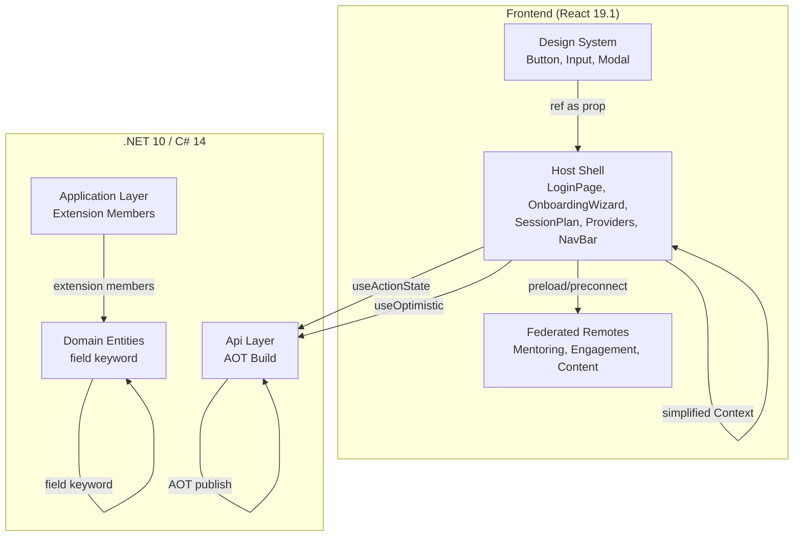
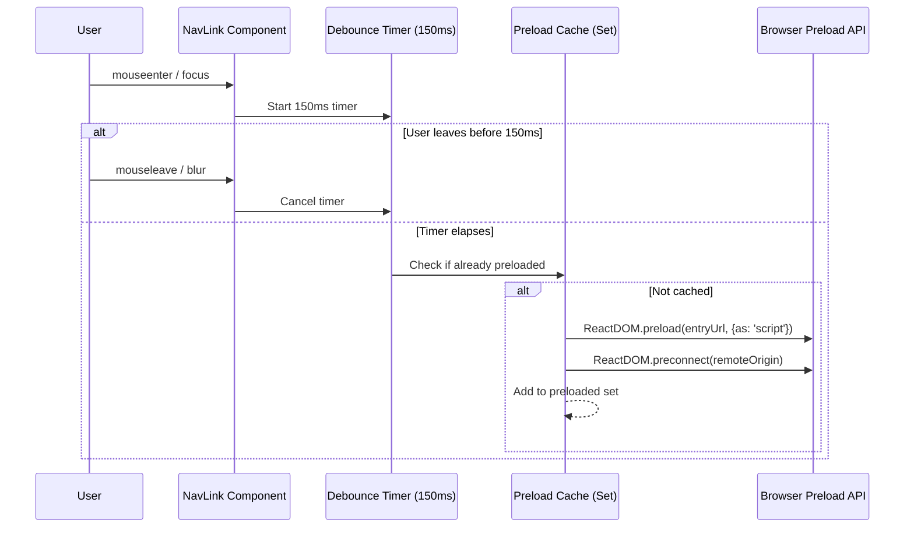

# Design Document: React 19 + .NET 10 Modernization

## Overview

This design modernizes the GuidedMentor platform by adopting React 19.1 and .NET 10 / C# 14 language features across both frontend and backend layers. The changes are primarily syntactic and API-level — no new business logic is introduced. The goal is to reduce boilerplate, improve developer ergonomics, enable optimistic UI patterns, and leverage runtime improvements (smaller AOT binaries).

**Key design decisions:**

1. **Incremental migration** — Each requirement is independently shippable. Components, providers, entities, and extension methods are migrated file-by-file with existing tests as the regression safety net.
2. **No runtime behaviour change** — All refactorings preserve identical observable behaviour. The test suites are the acceptance gate: zero test modifications required (except test files that render `<Context.Provider>`).
3. **React 19 hooks over manual state** — `useActionState` and `useOptimistic` replace bespoke `useState` orchestrations for form submission and optimistic updates.
4. **Preloading is best-effort** — Resource hints (`preload`, `preconnect`) are fire-and-forget; failures are silently discarded.
5. **AOT verification is observational** — No source code changes; only SDK version and TFM update, then measure binary size delta.

## Architecture

The modernization operates within the existing Clean Architecture layering and Module Federation topology. No new services, databases, or infrastructure are introduced.



### Affected Layers

| Requirement | Layer | Bounded Contexts |
|---|---|---|
| 1. Remove forwardRef | Frontend — Design System, Mentoring Remote | — |
| 2. useActionState | Frontend — Host Shell (LoginPage, OnboardingWizard) | — |
| 3. useOptimistic | Frontend — Host Shell (SessionPlan) | — |
| 4. field keyword | Backend — Domain | Identity, Mentoring, Content, Engagement |
| 5. Extension members | Backend — Application/Infrastructure | Cross-context adapters |
| 6. Context provider syntax | Frontend — Host Shell, Remotes | — |
| 7. Preload federated remotes | Frontend — Host Shell (NavBar) | — |
| 8. AOT binary size | Backend — Api/Lambda projects | All |

## Components and Interfaces

### Requirement 1: Remove forwardRef

**Before (current):**
```tsx
export const Button = forwardRef<HTMLButtonElement, ButtonProps>(
  (props, ref) => <button ref={ref} {...props} />
);
Button.displayName = 'Button';
```

**After (React 19.1):**
```tsx
export function Button({ ref, ...props }: ButtonProps & { ref?: React.Ref<HTMLButtonElement> }) {
  return <button ref={ref} {...props} />;
}
```

**Components to migrate:**
- `frontend/packages/design-system/src/components/Button.tsx` — `HTMLButtonElement`
- `frontend/packages/design-system/src/components/Input.tsx` — `HTMLInputElement`
- `frontend/packages/design-system/src/components/Modal.tsx` — `HTMLDivElement`
- `frontend/remotes/mentoring/src/components/MentorCard.tsx` — `HTMLDivElement`

**Interface contract:** Each component's props type gains an optional `ref?: React.Ref<ElementType>` property. The `displayName` assignment is removed (function name serves as display name). All existing call sites continue to work unchanged because React 19 passes `ref` as a regular prop.

### Requirement 2: useActionState for Form Submissions

**State type:**
```tsx
type FormActionState =
  | { status: 'idle' }
  | { status: 'success'; email?: string }
  | { status: 'error'; message: string };
```

**LoginPage transformation:**
```tsx
import { useActionState } from 'react';

async function loginAction(prev: FormActionState, formData: FormData): Promise<FormActionState> {
  const email = formData.get('email') as string;
  if (!email.includes('@')) {
    return { status: 'error', message: 'Please enter a valid email address.' };
  }
  const response = await fetch(apiUrl('/v1/auth/magic-link'), {
    method: 'POST',
    headers: { 'Content-Type': 'application/json' },
    body: JSON.stringify({ email }),
  });
  if (!response.ok) return { status: 'error', message: 'Something went wrong. Please try again.' };
  return { status: 'success', email };
}

// In component:
const [state, formAction, isPending] = useActionState(loginAction, { status: 'idle' });
```

**OnboardingWizard transformation:** The final "Complete" step wraps its submission in a `<form action={formAction}>` with `useActionState` managing the submit lifecycle. On success the action returns `{ status: 'success', redirectTo: '/dashboard' }` which triggers navigation.

**Eliminated state:** `useState<LoginState>`, `useState(error)`, `useState('loading')` are replaced by the single `useActionState` return value.

### Requirement 3: useOptimistic for Session Actions

**SessionPlan hook:**
```tsx
import { useOptimistic } from 'react';

type OptimisticAction = { type: 'complete' | 'book'; sessionId: string };

const [optimisticData, addOptimistic] = useOptimistic(
  serverData,
  (current: PlanData, action: OptimisticAction) => ({
    ...current,
    status: action.type === 'complete' ? 'completed' : current.status,
    pendingAction: action,
  })
);
```

**Flow:**
1. User clicks "Mark My Sessions Complete"
2. `addOptimistic({ type: 'complete', sessionId })` — UI updates within frame
3. `mutateAsync(sessionId)` fires the server request
4. On success: TanStack Query invalidates and provides confirmed data
5. On failure: React automatically reverts the optimistic state; error toast shown in `aria-live="polite"` region

**Visual indicators during pending:**
- Affected element rendered at `opacity-50`
- `aria-busy="true"` on the element
- Revert within 500ms on failure with 5-second error notification

### Requirement 4: C# 14 field Keyword

**Pattern transformation (when explicit backing fields exist with validation):**

Before:
```csharp
private string _title;
public string Title
{
    get => _title;
    set => _title = value?.Trim() ?? throw new ArgumentNullException(nameof(value));
}
```

After:
```csharp
public string Title
{
    get;
    set => field = value?.Trim() ?? throw new ArgumentNullException(nameof(value));
}
```

**Current state of codebase:** The existing domain entities (User, MentorEntity, Session, OpportunityPosting) primarily use auto-properties with `private set` and factory methods for validation. They do not currently have explicit backing fields with setter validation. The `field` keyword applies when:
- A property has an explicit `private T _fieldName;` declaration
- The property accessor references that field for validation or transformation
- The backing field is used only by that single property

**Exclusion criteria (per AC 4.5):**
- Auto-properties with no explicit backing field — skip
- Computed expression-bodied getters (`public bool IsActive => !IsDisabled;`) — skip
- Backing fields referenced by multiple properties or outside the accessor — skip

**Practical scope:** Convert any existing or newly-introduced explicit backing fields across all four bounded contexts. If domain entities gain setter validation (e.g., `Title` length enforcement in `OpportunityPosting`), those are prime candidates.

### Requirement 5: Extension Members

**Pattern transformation:**

Before:
```csharp
public static class MentorEntityExtensions
{
    public static string FormattedAvailability(this MentorEntity mentor) =>
        mentor.Availability.Status.ToString();

    public static MentorBrowseDto ToBrowseDto(this MentorEntity mentor) => new(
        mentor.Id, mentor.DisplayName, mentor.Availability);
}
```

After:
```csharp
extension(MentorEntity mentor)
{
    public string FormattedAvailability =>
        mentor.Availability.Status.ToString();

    public MentorBrowseDto ToBrowseDto() => new(
        mentor.Id, mentor.DisplayName, mentor.Availability);
}
```

**Scope rules:**
- Convert: Extension methods whose `this` parameter is a domain type, value object, or entity within the same bounded context
- Exclude: DI registration extensions on `IServiceCollection` (ServiceCollectionExtensions, FeatureFlagExtensions)
- Exclude: Middleware pipeline extensions on `IApplicationBuilder` (MaintenanceModeMiddlewareExtensions)
- Exclude: Health check and observability extensions (HealthCheckExtensions, ObservabilityExtensions)

**Mixed classes (AC 5.4):** If a static class contains both extension methods (on domain types) and non-extension static helpers, only the extension methods move to an `extension` block; the remaining statics stay in the original class.

### Requirement 6: Simplified Context Provider

**AuthProvider.tsx:**
```tsx
// Before
return <AuthContext.Provider value={value}>{children}</AuthContext.Provider>;

// After
return <AuthContext value={value}>{children}</AuthContext>;
```

**RoleProvider.tsx:**
```tsx
// Before
return <RoleContext.Provider value={value}>{children}</RoleContext.Provider>;

// After
return <RoleContext value={value}>{children}</RoleContext>;
```

**Files affected:**
- `frontend/host-shell/src/providers/AuthProvider.tsx`
- `frontend/host-shell/src/providers/RoleProvider.tsx`
- Any context providers in federated remotes
- Test files rendering `<XContext.Provider>` wrappers (update to `<XContext>`)

### Requirement 7: Preload Federated Resources

**Architecture:**



**Implementation: `usePreloadRemote` hook**
```tsx
import { preload, preconnect } from 'react-dom';

const preloadedUrls = new Set<string>();

export function usePreloadRemote(remoteEntry: string) {
  const timerRef = useRef<ReturnType<typeof setTimeout>>();

  const onIntent = useCallback(() => {
    timerRef.current = setTimeout(() => {
      if (!preloadedUrls.has(remoteEntry)) {
        try {
          preload(remoteEntry, { as: 'script' });
          const origin = new URL(remoteEntry).origin;
          if (origin !== window.location.origin) {
            preconnect(origin);
          }
          preloadedUrls.add(remoteEntry);
        } catch { /* silently discard */ }
      }
    }, 150);
  }, [remoteEntry]);

  const onCancel = useCallback(() => {
    clearTimeout(timerRef.current);
  }, []);

  return { onMouseEnter: onIntent, onFocus: onIntent, onMouseLeave: onCancel, onBlur: onCancel };
}
```

**Integration point:** Applied to `<Link>` and `<MobileNavLink>` elements in NavBar that route to federated remotes (`/browse` → mentoring, `/opportunities` → mentoring, `/notifications` → engagement).

**Remote entry URL mapping:**
```typescript
const REMOTE_ENTRIES: Record<string, string> = {
  '/browse': '/remotes/mentoring/remoteEntry.js',
  '/opportunities': '/remotes/mentoring/remoteEntry.js',
  '/notifications': '/remotes/engagement/remoteEntry.js',
};
```

### Requirement 8: AOT Binary Size Verification

**Process:**
1. `dotnet publish` each Lambda project with AOT flags: `-c Release -r linux-x64 --self-contained /p:PublishAot=true`
2. Measure output binary size in MB (rounded to 2 decimal places)
3. Compare against baseline stored in `tools/aot-baselines.json`
4. Output summary table: function name | baseline MB | current MB | delta %
5. If any delta > 0% → emit `⚠️ REGRESSION` warning line

**Baseline file (`tools/aot-baselines.json`):**
```json
{
  "baselines": [
    {
      "functionName": "GuidedMentor.Identity.Lambda",
      "baselineMb": 0,
      "recordedAt": null,
      "sdkVersion": "9.0.200"
    }
  ]
}
```

First run: records current size as baseline, skips comparison.

## Data Models

### Form Action State (Requirement 2)

```typescript
type FormActionState =
  | { status: 'idle' }
  | { status: 'success'; email?: string; redirectTo?: string }
  | { status: 'error'; message: string; fieldErrors?: Record<string, string> };
```

### Optimistic Session State (Requirement 3)

```typescript
interface OptimisticSessionAction {
  type: 'mark-complete' | 'book-session';
  sessionId: string;
  timestamp: number;
}

type SessionDisplayState = PlanData & {
  pendingAction?: OptimisticSessionAction;
};
```

### AOT Baseline Record (Requirement 8)

```typescript
interface AotBaseline {
  functionName: string;
  baselineMb: number;
  recordedAt: string | null;
  sdkVersion: string;
}

interface AotBaselineFile {
  baselines: AotBaseline[];
}
```

### Remote Entry Registry (Requirement 7)

```typescript
interface FederatedRemoteEntry {
  name: string;
  entryUrl: string;
  routePrefix: string;
}
```

## Correctness Properties

*A property is a characteristic or behavior that should hold true across all valid executions of a system — essentially, a formal statement about what the system should do. Properties serve as the bridge between human-readable specifications and machine-verifiable correctness guarantees.*

### Property 1: Component render equivalence without ref

*For any* valid combination of props (variant, size, loading, disabled, className, label, error, helpText, open, onClose, title, children) passed to a design system component (Button, Input, Modal), the refactored function component SHALL produce identical DOM output (element types, CSS classes, ARIA attributes, text content) as the pre-refactor forwardRef version when no `ref` prop is provided.

**Validates: Requirements 1.5**

### Property 2: Form action state machine correctness

*For any* email string input to the LoginPage action function, the returned state SHALL be `{ status: 'error', message }` if the email does not contain an "@" character (without making a network request), or SHALL be a valid `FormActionState` (`success` or `error`) if the email contains "@" (after network interaction).

**Validates: Requirements 2.1, 2.4**

### Property 3: Error display accessibility attributes

*For any* error message string returned by a form action, the rendered error element SHALL have `role="alert"` and SHALL be referenced by the associated form field's `aria-describedby` attribute.

**Validates: Requirements 2.3**

### Property 4: Wizard form data preservation on submission failure

*For any* combination of previously entered form data across OnboardingWizard steps (name, careerGoal, selectedCategories, targetRole), if the final step form action returns an error state, all previously entered data SHALL remain accessible and displayed in the UI without modification.

**Validates: Requirements 2.6**

### Property 5: Optimistic state revert on rejection

*For any* session with a prior status (Active, PendingPlan, etc.) and any optimistic action (mark-complete or book-session), if the server rejects the request or times out, the displayed session state SHALL revert to equal the prior status exactly, and an error notification SHALL appear in an `aria-live="polite"` region.

**Validates: Requirements 3.2, 3.5**

### Property 6: Pending optimistic action visual indicators

*For any* UI element with a pending optimistic update awaiting server confirmation, the element SHALL be rendered at 50% opacity (CSS `opacity: 0.5`) and SHALL have `aria-busy="true"` set on the element.

**Validates: Requirements 3.3**

### Property 7: Property setter behavioural equivalence with field keyword

*For any* input value (valid or invalid) passed to a domain entity property setter that uses the `field` keyword, the result SHALL be identical to the previous explicit-backing-field implementation: valid values are stored with the same transformation applied, and invalid values produce the same exception type and message.

**Validates: Requirements 4.2, 4.4**

### Property 8: Extension member functional equivalence

*For any* domain entity or value object instance, invoking an extension member (property or method) SHALL produce an identical return value to invoking the equivalent pre-conversion static extension method on the same instance.

**Validates: Requirements 5.1, 5.2**

### Property 9: Preload debounce threshold

*For any* hover/focus duration on a navigation link mapped to a federated remote, `ReactDOM.preload()` SHALL be called if and only if the duration is at least 150 milliseconds. If the user triggers `mouseLeave`/`blur` before 150ms elapses, the preload SHALL NOT fire.

**Validates: Requirements 7.1, 7.6**

### Property 10: Cross-origin preconnect

*For any* federated remote entry URL, `ReactDOM.preconnect()` SHALL be called if and only if the URL's origin differs from `window.location.origin`. Same-origin remotes SHALL NOT trigger a `preconnect` call.

**Validates: Requirements 7.2**

### Property 11: Preload silent failure handling

*For any* error thrown or rejected by the preload mechanism (network error, 404, TypeError, unavailable remote), the error SHALL NOT propagate to user-visible UI, SHALL NOT alter application state, and SHALL NOT throw an unhandled exception.

**Validates: Requirements 7.5**

### Property 12: Preload deduplication (idempotence)

*For any* federated remote entry URL that has already been preloaded (or is currently loading) during the page session, subsequent preload triggers for the same URL SHALL NOT issue additional `ReactDOM.preload()` calls. The number of actual preload requests for a given URL SHALL always equal exactly 1 regardless of how many times the user hovers the corresponding link.

**Validates: Requirements 7.7**

### Property 13: AOT binary size comparison correctness

*For any* pair of positive numbers (baselineMb, currentMb), the reported delta SHALL equal `((currentMb - baselineMb) / baselineMb) * 100` rounded to one decimal place with sign preserved, and a regression warning SHALL be emitted if and only if `currentMb > baselineMb`.

**Validates: Requirements 8.3, 8.4**

## Error Handling

### Frontend Error Handling

| Scenario | Handling |
|---|---|
| `useActionState` action throws | Caught inside action function; returns `{ status: 'error', message }`. Never propagates unhandled. |
| `useOptimistic` server rejection | React reverts optimistic state automatically. Error toast displayed in `aria-live="polite"` region for 5 seconds. |
| `useOptimistic` server timeout (10s) | Same as rejection — revert + error notification. Implemented via AbortController with 10-second timeout. |
| Preload network error | `try/catch` around `preload()`/`preconnect()` silently discards. No UI impact. |
| Preload invalid URL | Caught by `try/catch` in `usePreloadRemote`. Logged to console in dev only. |
| Form action during ongoing submission | `isPending` from `useActionState` disables submit button — prevents double submission. |

### Backend Error Handling

| Scenario | Handling |
|---|---|
| `field` keyword with null assignment | Setter validation unchanged — throws `ArgumentNullException` as before. |
| Extension member on null instance | NullReferenceException as before — extension members behave identically to extension methods on null. |
| AOT build failure | Script exits with non-zero code; no baseline recorded. CI reports failure. |
| AOT baseline file missing/corrupt | Script creates fresh baseline file on first run. JSON parse errors → recreate file. |

## Testing Strategy

### Unit Tests (Example-Based)

**Frontend (Vitest + React Testing Library):**
- Each design system component: render with ref → verify `ref.current` type
- LoginPage: submit with valid email → verify "check your inbox" view
- OnboardingWizard: complete final step → verify navigation to dashboard
- SessionPlan: click complete → verify optimistic UI appears, then confirm/revert
- Context providers: render with simplified syntax → verify consumers receive values
- Preload hook: hover for 200ms → verify preload called; hover for 100ms → verify not called

**Backend (xUnit + FluentAssertions):**
- Each entity with `field` keyword: setter with valid/invalid inputs → verify same behaviour
- Extension members: invoke on known instances → verify identical output to old methods
- AOT size script: known baseline + current → verify correct delta calculation

### Property-Based Tests

**Frontend (Vitest + fast-check):**
- Property 2: `fc.string()` for email generation → verify action state correctness
- Property 9: `fc.integer({ min: 0, max: 500 })` for hover duration → verify preload fires iff >= 150
- Property 10: `fc.webUrl()` for remote entries → verify preconnect iff cross-origin
- Property 11: `fc.oneof(fc.constant('TypeError'), fc.constant('NetworkError'), ...)` → verify silent discard
- Property 12: `fc.integer({ min: 1, max: 10 })` for repeat count → verify exactly 1 preload call
- Property 13: `fc.float({ min: 0.01, max: 100 })` pairs → verify delta formula

**Backend (FsCheck):**
- Property 7: `Arb.generate<string>` for property setter inputs → verify equivalence
- Property 8: Custom Arbitrary for domain entities → verify extension member equivalence

**Configuration:**
- Minimum 100 iterations per property test
- Tag format: `[Trait("Category", "Property")]` with name `Property{N}_{Description}`
- Frontend tag: comment `// Feature: react19-dotnet10-modernization, Property {N}: {title}`

### Test Libraries

| Layer | Framework | PBT Library |
|---|---|---|
| Frontend | Vitest + React Testing Library | fast-check |
| Backend | xUnit + FluentAssertions | FsCheck |

### Coverage Expectations

- Design system components: existing coverage maintained (≥70%)
- Form action functions (pure logic): ≥95% via property tests
- `usePreloadRemote` hook: ≥95% via property tests
- AOT size calculation: ≥95% via property tests
- Domain entity setters: existing coverage maintained via regression suite
- Extension members: existing coverage maintained via regression suite
