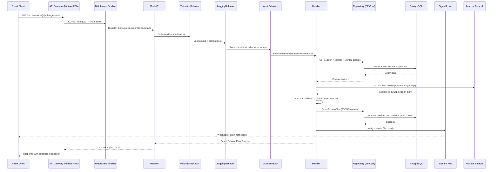
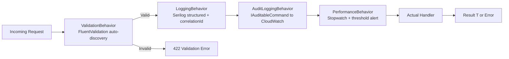
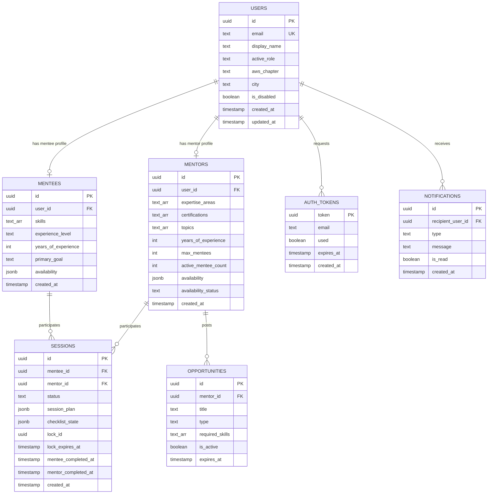
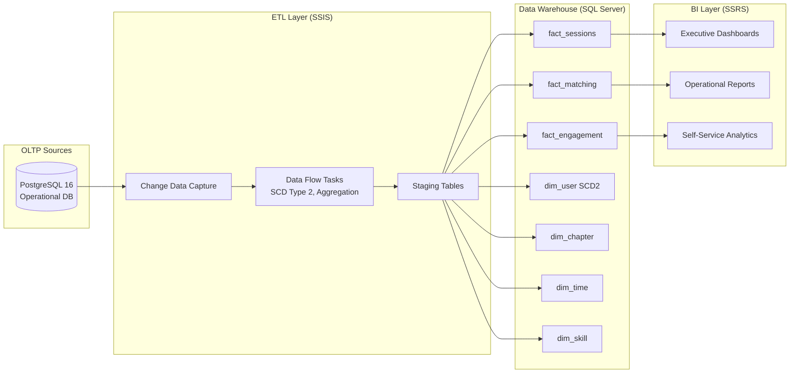
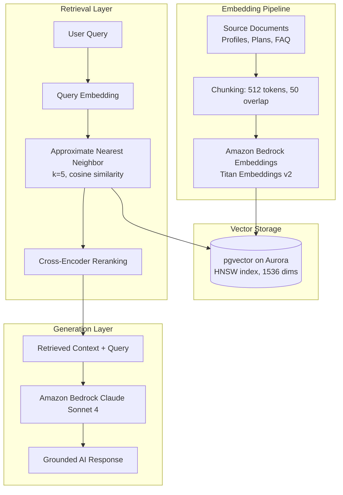
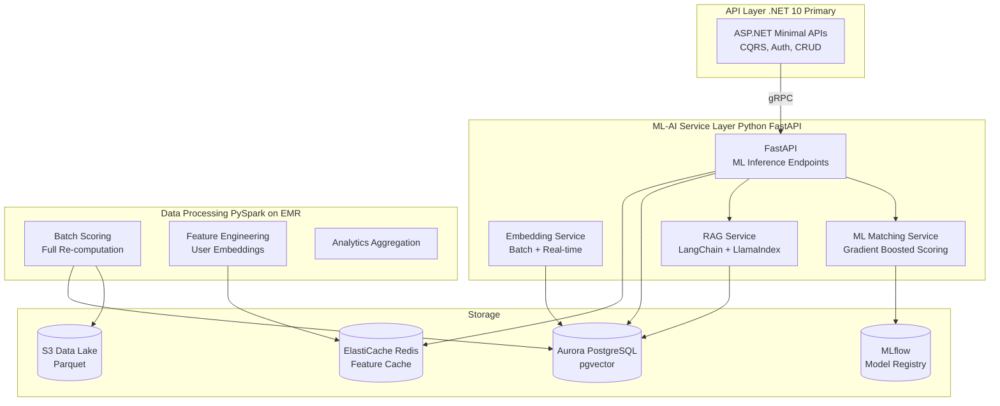
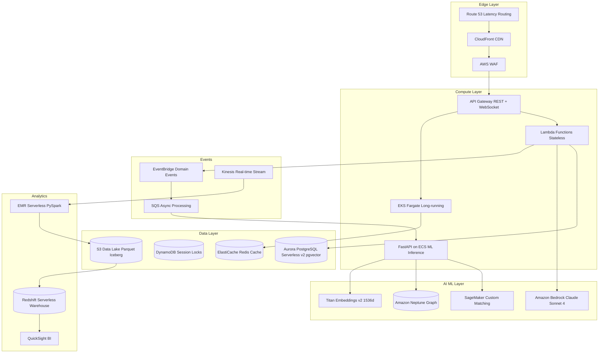

# GuidedMentor — Senior AI Data Engineer Interview Preparation Guide

> **Candidate Profile**: Senior AI Data Engineer (20+ Years Experience)
> **Project**: GuidedMentor — AI-Powered Mentorship Platform
> **Core Objective**: Demonstrate deep expertise in traditional data stacks, enterprise backend architectures, and modern cloud-native AI/Data scaling.

---

## 1. Executive Summary & Core Project Architecture

### High-Level Technical Overview

GuidedMentor is a production-ready, AI-powered mentorship platform connecting AWS Community Builders across Australia with experienced professionals. The platform implements:

- **Domain-Driven Design (DDD)** with 4 bounded contexts (Identity, Mentoring, Content, Engagement)
- **Clean Architecture** (.NET 10 + ASP.NET Minimal APIs) with strict layer separation
- **CQRS Pattern** via MediatR with pipeline behaviours (Validation → Logging → Audit → Performance → Handler)
- **AI-Powered Features**: Rule-based matching engine (0-100 compatibility scoring) and personalised session plan generation via Amazon Bedrock (Claude Sonnet 4)
- **Real-Time Communication**: SignalR WebSocket hub for push notifications
- **Background Processing**: Hangfire for scheduled jobs (token cleanup, opportunity expiry)
- **Passwordless Authentication**: Magic links (UUID, 10-min TTL, single-use) + Google OAuth, self-issued JWT (HMAC-SHA256)

**Current Hosting (Free Tier)**: Vercel (frontend) + Railway (backend) + Supabase (PostgreSQL) — $0/month
**Future AWS Migration Path**: Terraform IaC with 9 modules pre-built (Lambda, Aurora, DynamoDB, CloudFront, S3, WAF, etc.)

### Key Data Characteristics

| Dimension | Current Scale | Enterprise Target |
|---|---|---|
| Users | ~100 (community pilot) | 500K+ mentors/mentees globally |
| Sessions | ~50 active | 2M+ annual sessions |
| AI Invocations | ~200/day | 500K+/day with streaming |
| Notifications | ~1K/day (SignalR) | 10M+/day (multi-channel) |
| Data Volume | ~500MB PostgreSQL | Petabyte-scale data lake |
| Matching Engine | Real-time in-memory | Distributed ML-powered scoring |

### DIAGRAM 1: Comprehensive End-to-End Application Architecture

```mermaid
graph TB
    subgraph "CLIENT LAYER"
        BROWSER[Browser / PWA<br/>React 19 + Module Federation]
        MOBILE[Mobile Web<br/>Responsive PWA]
    end

    subgraph "CDN & EDGE"
        VERCEL[Vercel Edge Network<br/>Static Assets + SSR]
    end

    subgraph "API GATEWAY LAYER"
        RAILWAY[Railway Container<br/>ASP.NET Minimal APIs .NET 10]
        CORS[CORS Middleware]
        AUTH_MW[JWT Auth Middleware]
        RATE[Rate Limiter<br/>100 req/min API, 3/15min Magic Link]
    end

    subgraph "APPLICATION LAYER — CQRS"
        MEDIATR[MediatR Dispatcher]
        VAL[ValidationBehavior<br/>FluentValidation]
        LOG[LoggingBehavior<br/>Serilog + Correlation IDs]
        AUDIT[AuditLoggingBehavior<br/>IAuditableCommand]
        PERF[PerformanceBehavior<br/>Latency Tracking]
        HANDLERS[Command/Query Handlers]
    end

    subgraph "DOMAIN LAYER — Pure Business Logic"
        IDENTITY[Identity Context<br/>User Aggregate, MagicLink, Role Toggle]
        MENTORING[Mentoring Context<br/>Session Aggregate, MatchingEngine]
        CONTENT[Content Context<br/>SessionPlan Aggregate, AI Generation]
        ENGAGEMENT[Engagement Context<br/>Notification Aggregate, Intent Classifier]
    end

    subgraph "INFRASTRUCTURE LAYER"
        EF[EF Core 10<br/>PostgreSQL Provider]
        SIGNALR[SignalR Hub<br/>/hubs/notifications]
        HANGFIRE[Hangfire Server<br/>Background Jobs]
        MAILKIT[MailKit<br/>Gmail SMTP]
        POLLY[Polly v8<br/>Resilience Pipelines]
    end

    subgraph "DATA LAYER"
        PG[(PostgreSQL 16<br/>Supabase Managed<br/>JSONB + TEXT Arrays + UUID PKs)]
    end

    subgraph "EXTERNAL SERVICES"
        BEDROCK[Amazon Bedrock<br/>Claude Sonnet 4<br/>Session Plan Generation]
        GOOGLE[Google OAuth 2.0<br/>Social Identity]
        GMAIL_SVC[Gmail SMTP<br/>Magic Link Delivery]
    end

    subgraph "OBSERVABILITY"
        SERILOG[Serilog Structured Logging]
        OTEL[OpenTelemetry Traces]
        HEALTH[/v1/health Endpoint]
    end

    BROWSER --> VERCEL
    MOBILE --> VERCEL
    VERCEL -->|HTTPS /v1/*| RAILWAY
    VERCEL -->|WebSocket| SIGNALR

    RAILWAY --> CORS --> AUTH_MW --> RATE --> MEDIATR
    MEDIATR --> VAL --> LOG --> AUDIT --> PERF --> HANDLERS

    HANDLERS --> IDENTITY
    HANDLERS --> MENTORING
    HANDLERS --> CONTENT
    HANDLERS --> ENGAGEMENT

    IDENTITY --> EF
    MENTORING --> EF
    CONTENT --> EF
    ENGAGEMENT --> EF

    EF --> PG
    HANGFIRE --> PG
    SIGNALR -.->|Push to clients| BROWSER
    MAILKIT --> GMAIL_SVC
    CONTENT -->|IChatClient| BEDROCK
    ENGAGEMENT -->|IChatClient| BEDROCK
    IDENTITY -->|OAuth2 Flow| GOOGLE

    HANDLERS --> SERILOG
    HANDLERS --> OTEL
    RAILWAY --> HEALTH
```

### Talking Points for Section 1

- **Why DDD?** The mentoring domain has complex business rules — matching algorithms, session lifecycle state machines, mutual completion flows — that benefit from explicit aggregate boundaries and domain events for cross-context communication.
- **Why Clean Architecture?** We successfully migrated from DynamoDB to PostgreSQL by only replacing Infrastructure implementations. Domain and Application layers were untouched — proving the architecture's value.
- **Why CQRS?** Read and write workloads have fundamentally different characteristics. Browse queries (12 mentors × scoring) are read-heavy and cacheable. Session state transitions require strong consistency and audit trails.
- **Cost Optimisation**: The entire production stack runs at $0/month using free tiers, demonstrating that architectural excellence isn't dependent on infrastructure spend.

---

## 2. Backend & API Design (Current Implementation)

### API Architecture Pattern: REST with Minimal APIs

**Why REST over GraphQL/gRPC:**
- **REST** was chosen because the platform has well-defined resource boundaries (users, mentors, sessions, plans) with predictable CRUD operations. The 4 bounded contexts map cleanly to REST resource hierarchies.
- **GraphQL** was considered but rejected — the data graph is not deeply nested, and the added complexity of a resolver layer didn't justify the flexibility gains for this domain.
- **gRPC** would be used for inter-service communication in a microservices decomposition (future state), but the current monolithic host makes it unnecessary.

### Endpoint Design

| Method | Endpoint | Context | Auth | Purpose |
|---|---|---|---|---|
| POST | `/v1/auth/magic-link` | Identity | Anonymous | Request magic link (always returns 200) |
| POST | `/v1/auth/verify-magic-link` | Identity | Anonymous | Verify token, issue JWT |
| POST | `/v1/auth/google` | Identity | Anonymous | Google OAuth exchange |
| GET | `/v1/browse/mentors` | Mentoring | Bearer | Paginated browse with live scoring |
| POST | `/v1/browse/lock/{mentorId}` | Mentoring | Bearer | 15-min exclusive lock |
| POST | `/v1/sessions` | Mentoring | Bearer | Create session from lock |
| PATCH | `/v1/sessions/{id}/accept` | Mentoring | Bearer | Mentor accepts request |
| PATCH | `/v1/sessions/{id}/complete` | Mentoring | Bearer | Mark complete (role-aware) |
| POST | `/v1/sessions/{id}/plan/generate` | Content | Bearer | Trigger AI plan generation |
| GET | `/v1/sessions/{id}/plan` | Content | Bearer | Retrieve generated plan |
| POST | `/v1/assistant/chat` | Engagement | Bearer | AI help (SSE streaming) |
| GET | `/v1/notifications` | Engagement | Bearer | User notifications |
| GET | `/v1/dashboard/mentee` | Engagement | Bearer | Mentee dashboard data |
| GET | `/v1/dashboard/mentor` | Engagement | Bearer | Mentor dashboard data |
| GET | `/v1/health` | Shared | Anonymous | Dependency health check |

### Authentication & Authorisation

**Passwordless Architecture (Zero Password Storage):**
1. User requests magic link → API generates UUID token (122-bit entropy), stores in `auth_tokens` table with 10-min TTL
2. Always returns HTTP 200 (prevents email enumeration attacks)
3. Email delivered via Gmail SMTP (MailKit)
4. User clicks link → token verified (single-use) → self-issued JWT returned
5. JWT: HMAC-SHA256, 15-min access token + 7-day rotating refresh token
6. Rate limited: max 3 magic link requests per email per 15 minutes

**Google OAuth 2.0:** Alternative social identity federation — exchanges authorization code for platform JWT.

### Rate Limiting Strategy

| Endpoint Category | Limit | Window | Rationale |
|---|---|---|---|
| General API | 100 requests | 1 minute | Prevents abuse while allowing normal usage |
| Magic Link Request | 3 requests | 15 minutes | Anti-enumeration + cost control |
| AI Chat | 20 requests | 1 minute | Token cost management (Bedrock pricing) |
| Browse Mentors | 30 requests | 1 minute | Compute-intensive (matching engine) |

### Performance Optimisation

- **Connection Pooling**: EF Core manages PostgreSQL connection pool (default 100 connections via Npgsql)
- **Pagination**: All list endpoints use cursor/offset pagination (default page size 12)
- **Lazy Loading Disabled**: Explicit eager loading via `.Include()` to prevent N+1 queries
- **Response Compression**: Brotli/Gzip middleware for JSON responses
- **Caching Strategy**: TanStack Query on frontend (stale-while-revalidate), with cache invalidation via SignalR pushes
- **Streaming**: AI responses use Server-Sent Events (SSE) for real-time token delivery
- **Resilience**: Polly v8 pipelines with circuit breaker + retry + timeout for external calls (Bedrock, Gmail)

### Error Response Contract

All errors follow a consistent shape for client consumption:
```json
{
  "statusCode": 422,
  "error": "ValidationError",
  "message": "Cannot reduce maxMentees to 2. You currently have 3 active mentee(s).",
  "correlationId": "3fa85f64-5717-4562-b3fc-2c963f66afa6"
}
```
No stack traces are ever exposed. Correlation IDs enable distributed tracing across Serilog → OpenTelemetry → CloudWatch.

### DIAGRAM 2: API Design & Component Interaction Flow



### MediatR Pipeline Behaviours (Cross-Cutting Concerns)



### Talking Points for Section 2

- **Minimal APIs vs Controllers**: Chosen for performance (no reflection overhead), AOT-readiness, and conciseness. Each endpoint is 5-10 lines mapping HTTP to MediatR.
- **OpenAPI 3.1 Auto-Generation**: Scalar docs at `/scalar/v1` — contract-first development enables typed client generation.
- **Anti-Enumeration Pattern**: Magic link endpoint always returns 200 regardless of email existence. This is a deliberate security decision, not a bug.
- **Optimistic Concurrency**: Session locking uses a 15-minute TTL lock with `LockId` and `LockExpiresAt` columns — prevents two mentees from requesting the same mentor simultaneously.
- **Idempotency**: Magic link verification is single-use (token marked `used=true` on first verify). Prevents replay attacks.

---

## 3. Database Design & Relational Storage (Current Implementation)

### Relational Schema Design (PostgreSQL 16)

The database schema follows DDD aggregate boundaries with explicit table-per-entity mapping. EF Core handles the ORM layer with a clear separation between persistence entities (Infrastructure) and domain entities (Domain).

**Design Decisions:**
- **UUID Primary Keys**: All tables use `UUID` PKs generated application-side — enables distributed ID generation without sequences
- **JSONB Columns**: Used for complex nested data (session plans, availability schedules, checklist state) — avoids excessive normalisation for read-heavy structures
- **TEXT[] Arrays**: PostgreSQL native arrays for skills, certifications, topics — enables containment operator for efficient filtering
- **snake_case Columns**: PostgreSQL convention, mapped via EF Core fluent configuration
- **Timestamps**: `created_at` and `updated_at` on all mutable entities for audit compliance

### Core Tables and Relationships

| Table | PK | Key Columns | Indexes | Context |
|---|---|---|---|---|
| `users` | `id` (UUID) | email, display_name, active_role, aws_chapter, city, is_disabled | UNIQUE(email) | Identity |
| `mentors` | `id` (UUID) | user_id (FK), expertise_areas (TEXT[]), topics (TEXT[]), max_mentees, active_mentee_count, availability (JSONB) | — | Mentoring |
| `mentees` | `id` (UUID) | user_id (FK), skills (TEXT[]), primary_goal, years_of_experience, availability (JSONB) | — | Mentoring |
| `sessions` | `id` (UUID) | mentee_id, mentor_id, status, session_plan (JSONB), checklist_state (JSONB), lock_id, lock_expires_at | — | Mentoring |
| `auth_tokens` | `token` (UUID) | email, used, expires_at | — | Identity |
| `notifications` | `id` (UUID) | recipient_user_id, type, message, is_read | — | Engagement |
| `opportunities` | `id` (UUID) | mentor_id, title, type, required_skills (TEXT[]), is_active, expires_at | — | Mentoring |
| `meetups` | `id` (UUID) | chapter, title, event_date, venue_name, is_cancelled | — | Engagement |
| `engagement_events` | `id` (UUID) | user_id_hash, event_type, metadata (JSONB), active_role | — | Engagement |

### Indexing Strategy

| Index | Type | Purpose |
|---|---|---|
| `users.email` | UNIQUE B-tree | Fast login lookup, enforce uniqueness |
| `sessions(mentee_id, status)` | Composite B-tree | Dashboard queries (active sessions per mentee) |
| `sessions(mentor_id, status)` | Composite B-tree | Dashboard queries (pending requests per mentor) |
| `auth_tokens(expires_at)` | B-tree | Hangfire cleanup job (expired token deletion) |
| `notifications(recipient_user_id, is_read)` | Composite B-tree | Unread count badge queries |
| `opportunities(is_active, expires_at)` | Partial index | Active opportunity filtering |
| `mentors.expertise_areas` | GIN | Array containment queries for skill matching |

### Normalisation vs Denormalisation Decisions

| Data | Strategy | Rationale |
|---|---|---|
| User profile fields | Normalised (3NF) | Frequently updated, low volume per record |
| Session plans | Denormalised (JSONB) | Write-once, complex nested structure, always read as a whole |
| Availability schedule | Denormalised (JSONB) | Complex time-slot structure, rarely queried independently |
| Skills/expertise | Semi-normalised (TEXT[]) | Queried with array operators, no join overhead |
| Checklist state | Denormalised (JSONB) | Frequent updates to individual items, read as whole for display |
| Engagement events | Denormalised (JSONB metadata) | Flexible schema, append-only analytics |

### Data Warehousing Strategy (Enterprise Context using SSIS/SSRS)

In an enterprise context using Microsoft SQL Server Ecosystem, the data warehousing strategy would layer as follows:

**ETL Pipeline (SSIS):**
1. **Extract**: Change Data Capture (CDC) on PostgreSQL source tables, SSIS packages pull incremental changes
2. **Transform**: SSIS Data Flow Tasks for SCD Type 2 on `users` (track role changes, chapter migrations), session fact aggregation, skill taxonomy normalisation, time-dimension enrichment
3. **Load**: Star schema into SQL Server Analysis Services (SSAS) cubes

**Star Schema Design:**
- **Fact Tables**: `fact_sessions` (session lifecycle events), `fact_matching` (browse/score events), `fact_engagement` (AI interactions, notifications)
- **Dimension Tables**: `dim_user`, `dim_chapter`, `dim_skill`, `dim_time`, `dim_session_status`
- **Slowly Changing Dimensions**: SCD Type 2 on `dim_user` (track role toggles, onboarding status changes over time)

**BI Reporting (SSRS):**
- Platform health dashboards (session completion rates, average matching scores)
- Mentor capacity utilisation reports
- AI cost analysis (token usage trends)
- Chapter engagement heatmaps
- Cohort retention analysis (30/60/90 day)

### DIAGRAM 3: Database Schema ERD and Warehousing Architecture



### Warehousing Layer Architecture



### Talking Points for Section 3

- **Why PostgreSQL over DynamoDB for current state?** The project originally used DynamoDB but migrated to PostgreSQL. Reason: complex relational queries (matching engine joins mentor + mentee profiles), JSONB flexibility, strong consistency guarantees, and $0 hosting via Supabase free tier.
- **JSONB vs Separate Tables for Session Plans**: Session plans are write-once (generated by AI), always read as a complete unit, and have variable schema (3-7 agenda items). JSONB avoids a 3-table join for every read.
- **GIN Index on TEXT[] Columns**: Enables efficient skill-based queries using PostgreSQL array containment operators, without needing a junction table.
- **SCD Type 2 for User Dimension**: Critical for analytics — we need to know what chapter a user was in at the time of a session, not just their current chapter.
- **CDC vs Full Extract**: CDC minimises ETL window from hours to minutes. For a platform with 2M+ annual sessions, full extracts would be prohibitively expensive.

---

## 4. Enterprise Scale-Out and Modern Cloud Transformation (AWS and Modern Stack)

### Re-Architecture Vision

Transform GuidedMentor from a single-region, free-tier deployment to a globally distributed, petabyte-scale AI-native platform capable of handling 500K+ users, 2M+ annual sessions, and real-time ML-powered matching.

### 4.1 Cloud Platform (AWS) Re-Platforming

| Current Component | AWS Target | Rationale |
|---|---|---|
| Railway (.NET container) | AWS Lambda + API Gateway / EKS Fargate | Serverless for stateless APIs; EKS for WebSocket |
| Supabase PostgreSQL | Amazon Aurora PostgreSQL Serverless v2 | Auto-scaling 0.5-128 ACUs, Multi-AZ, PITR |
| Vercel (React) | CloudFront + S3 | Global edge distribution, WAF integration |
| Gmail SMTP | Amazon SES | 62K free emails/month, bounce handling |
| Hangfire | AWS Step Functions + EventBridge Scheduler | Serverless orchestration |
| SignalR | AWS AppSync GraphQL Subscriptions | Managed WebSocket at scale |
| Self-issued JWT | Amazon Cognito | Managed auth, MFA, social federation |
| Serilog to Console | CloudWatch Logs + X-Ray | Centralised logging, distributed tracing |

**Multi-Region Strategy:**
- Primary: `ap-southeast-2` (Sydney) — closest to Australian user base
- DR: `ap-southeast-4` (Melbourne) — cross-region Aurora replication
- Edge: CloudFront PoPs across APAC for static assets

### 4.2 Data Transformation and Modeling with dbt

**Replacing legacy SSIS ETL with dbt (data build tool):**

```
dbt_project/
  models/
    staging/
      stg_users.sql              -- Source cleaning + typing
      stg_sessions.sql           -- JSONB extraction + flattening
      stg_matching_events.sql    -- Score decomposition
      stg_engagement.sql         -- Event parsing
    intermediate/
      int_session_lifecycle.sql  -- State machine transitions
      int_user_journey.sql       -- Onboarding funnel
      int_matching_effectiveness.sql  -- Score to outcome correlation
    marts/
      core/
        dim_users.sql            -- SCD Type 2 via dbt snapshots
        dim_chapters.sql         -- Australian chapter hierarchy
        fct_sessions.sql         -- Session fact grain
      engagement/
        fct_ai_interactions.sql  -- Token usage, latency, model version
        fct_notifications.sql    -- Delivery, read rates
      ml_features/
        user_embeddings_input.sql    -- Feature store input
        matching_training_data.sql   -- Historical match outcomes
  snapshots/
    user_snapshot.sql            -- SCD Type 2 implementation
  tests/
    assert_session_plan_valid.sql
    test_matching_score_bounds.sql
  macros/
    extract_jsonb_array.sql      -- Reusable JSONB parsing
```

**Why dbt over SSIS:**
- **Version controlled** — transformations live in Git alongside application code
- **Testable** — built-in data testing (uniqueness, referential integrity, custom assertions)
- **Modular** — ref() function creates a DAG; changes propagate automatically
- **Incremental** — dbt incremental models process only new/changed data
- **Cloud-native** — runs on Redshift, Snowflake, BigQuery, or Aurora directly
- **Documentation** — auto-generated lineage graphs and data dictionaries

### 4.3 Graph Database Layer (Neo4j / Amazon Neptune)

**Why Graph for GuidedMentor:**

The mentoring domain has inherently graph-shaped data: mentor-mentee relationships, skill networks, chapter communities, session chains, and opportunity recommendations form a complex interconnected network that relational JOINs handle poorly at scale.

**Graph Data Model:**

```
(:User {id, email, chapter})
  -[:HAS_ROLE {active}]-> (:Mentor {maxMentees, availability})
  -[:HAS_ROLE {active}]-> (:Mentee {primaryGoal, experienceLevel})

(:Mentor)-[:MENTORS {since, status}]->(:Mentee)
(:Mentor)-[:EXPERT_IN {years}]->(:Skill {name, category})
(:Mentee)-[:WANTS_TO_LEARN]->(:Skill)
(:Mentor)-[:BELONGS_TO]->(:Chapter {name, city, state})
(:Mentee)-[:BELONGS_TO]->(:Chapter)
(:Session {id, status})-[:BETWEEN]->(:Mentor)
(:Session)-[:BETWEEN]->(:Mentee)
(:Session)-[:HAS_PLAN]->(:SessionPlan {title, totalMinutes})
(:Skill)-[:RELATED_TO {strength}]->(:Skill)
(:Chapter)-[:NEAR {distance_km}]->(:Chapter)
```

**Key Graph Queries (Cypher):**

1. Enhanced Matching (2nd-degree connections):
```cypher
MATCH (mentee:Mentee {id: $menteeId})-[:WANTS_TO_LEARN]->(skill:Skill)
      <-[:EXPERT_IN]-(mentor:Mentor)
WHERE mentor.availability = 'available'
  AND mentor.activeMenteeCount < mentor.maxMentees
WITH mentor, COUNT(skill) as sharedSkills
MATCH (mentor)-[:BELONGS_TO]->(chapter:Chapter)
      <-[:NEAR]-(menteeChapter:Chapter)
      <-[:BELONGS_TO]-(mentee)
RETURN mentor, sharedSkills, chapter
ORDER BY sharedSkills DESC
LIMIT 12
```

2. Mentor Network Effect (who mentored my mentor?):
```cypher
MATCH path = (mentee:Mentee {id: $id})<-[:MENTORS*1..3]-(ancestor:Mentor)
RETURN path, LENGTH(path) as depth
```

3. Skill Gap Analysis:
```cypher
MATCH (mentee:Mentee {id: $id})-[:WANTS_TO_LEARN]->(goal:Skill)
MATCH (goal)-[:RELATED_TO*1..2]->(related:Skill)
WHERE NOT (mentee)-[:KNOWS]->(related)
RETURN related.name, COUNT(*) as relevance
ORDER BY relevance DESC
```

**Amazon Neptune vs Neo4j:**
- Neptune: Managed, serverless scaling, native AWS integration, Gremlin + openCypher
- Neo4j (Aura): More mature Cypher, better tooling, stronger community
- Recommendation: Neptune for production (AWS-native); Neo4j for development

### 4.4 Vector Infrastructure (Embeddings, Semantic Search, RAG)

**Use Cases for Vector Storage in GuidedMentor:**

1. **Semantic Matching** — Encode mentor expertise and mentee goals into vector space; find matches based on semantic similarity rather than keyword overlap.
2. **RAG for AI Help Assistant** — Embed platform documentation into a vector store. Retrieve relevant chunks per query, reducing token costs by 90%+ while improving answer quality.
3. **Session Plan Retrieval** — Find similar past session plans for new pairs based on embedding similarity.
4. **Opportunity Matching** — Semantic matching between opportunity descriptions and mentee skill profiles.

**Vector Store Selection Matrix:**

| Criteria | pgvector (Aurora) | OpenSearch Serverless | Pinecone |
|---|---|---|---|
| Operational overhead | Zero (same DB) | Low (managed) | Zero (SaaS) |
| Scale | 10M vectors | Billions | Billions |
| Metadata filtering | Full SQL WHERE | DSL filtering | Rich metadata |
| Cost at scale | Included in Aurora | ~$25/month | ~$70/month |
| Hybrid search | Limited | Excellent | Good |
| AWS-native | Yes | Yes | No |

**Recommendation**: Start with pgvector on Aurora (zero additional infra), graduate to OpenSearch Serverless when exceeding 10M vectors.

**RAG Architecture:**



### 4.5 Python Backend Ecosystem

**High-Performance Data Processing and AI Orchestration:**

| Library | Role in Architecture |
|---|---|
| **FastAPI** | High-performance async API for ML inference endpoints |
| **SQLAlchemy 2.0** | Async ORM for Python data services accessing Aurora PostgreSQL |
| **Pandas / Polars** | Data manipulation for analytics pipelines, feature engineering |
| **PySpark** | Distributed processing on EMR for petabyte-scale batch scoring |
| **LangChain** | RAG orchestration, prompt chaining, tool use with Bedrock |
| **LlamaIndex** | Document indexing, vector store abstraction, query engines |
| **scikit-learn** | Feature preprocessing, clustering, classification |
| **boto3** | AWS SDK for Bedrock, S3, SQS, DynamoDB, SES |
| **Pydantic** | Data validation, settings management, API schemas |
| **Celery + Redis** | Distributed task queue for async embedding generation |
| **MLflow** | Experiment tracking, model versioning, A/B testing |

**Python Service Architecture (Complementing .NET Core Backend):**



**Key Python Patterns:**

1. **Feature Store Pattern** — Pre-compute user embeddings and matching features nightly via PySpark on EMR. Store in Aurora (pgvector) + Redis (hot cache). Real-time inference uses cached features.

2. **A/B Testing for Matching Algorithm** — MLflow tracks experiments comparing rule-based (current) vs ML-based (gradient boosted) matching. Canary routes 10% traffic to ML model; measure session completion rate.

3. **Async Embedding Pipeline** — Profile update triggers SQS message to Python embedding service. New embeddings computed asynchronously, stored in pgvector. Browse results reflect updates within 30 seconds.

4. **RAG with Citation** — LlamaIndex query engine returns source nodes alongside answers. AI Help Assistant cites specific documentation sections.

### 4.6 Complete Cloud-Native Architecture Diagram



### Talking Points for Section 4

- **Polyglot Architecture**: .NET 10 for API layer (strong typing, CQRS). Python for ML/AI (superior ecosystem). gRPC for inter-service communication.
- **Aurora Serverless v2**: Auto-scales 0.5-128 ACUs. Off-peak scales down; browse spikes scale up in seconds.
- **Event-Driven over Polling**: EventBridge replaces Hangfire. Domain events flow through rules to targeted consumers.
- **Data Lake + Warehouse Duality**: S3 Iceberg for raw/processed lake; Redshift for analytical queries. Glue Catalog unifies schema.
- **pgvector first, OpenSearch later**: Start simple (same database), graduate when scale demands it.

---

## 5. Advanced Interview Scenarios and Edge Cases (Q&A Appendix)

### Category A: Architectural Pivots and Trade-offs

**Q1: Your matching engine is a pure in-memory function. How would you handle 500K users?**

The current MatchingEngine is O(n) per browse request. At 50K active mentors, that is 50K score computations per request.

Migration path:
1. Phase 1 (10K users): Redis cache. Pre-compute scores nightly. Invalidate on profile update.
2. Phase 2 (100K users): pgvector ANN search reduces candidate set from 50K to 500, then apply rule-based scoring on shortlist.
3. Phase 3 (500K+): ML matching model on SageMaker. Train on historical outcomes. Use 4-dimension scores as features alongside embeddings.

**Q2: How do you handle session plan AI generation failing?**

Three layers of resilience exist today:
1. SessionPlanPlugin retries up to 3 times with domain validation per attempt
2. Polly v8 circuit breaker: 5 failures in 30s opens circuit for 60s
3. Session transitions to Active without plan; UI shows retry button

At enterprise scale add: template fallback, multi-model failover (Claude Haiku if Sonnet unavailable), DLQ for replay.

**Q3: You migrated from DynamoDB to PostgreSQL. When would you migrate back?**

DynamoDB wins when: write throughput exceeds Aurora 200K/sec limit, access patterns are purely key-value, Global Tables needed for multi-region active-active. The answer is polyglot persistence: hot path (locks, notifications) in DynamoDB, relational core (users, sessions, matching) in Aurora.

### Category B: Data Drift and Schema Evolution

**Q4: How do you handle schema evolution on JSONB session_plan?**

1. Domain validation (SessionPlan.IsValid()) enforces invariants regardless of storage format
2. Version field in JSONB, application handles multiple versions via pattern matching
3. dbt data quality tests assert all plans pass validation
4. EF Core migrations update JSONB in-place using jsonb_set() for breaking changes

**Q5: GDPR right-to-deletion with engagement_events using user_id_hash?**

user_id_hash is one-way SHA-256 (not reversible without salt). Delete user row from `users` (CASCADE). Hashed events remain for analytics but are unlinkable. This follows anonymisation-as-deletion precedent in GDPR Article 11.

### Category C: High Availability and Failure Modes

**Q6: 15-minute session lock during PostgreSQL failover?**

Aurora failover takes 30-60 seconds. Lock writes fail with 503, client retries with backoff. Existing locks preserved (replicated before promotion). TTL expiry self-heals orphaned locks. At scale: move locks to DynamoDB (single-digit ms failover) or Redis SET NX EX.

**Q7: Zero-downtime deployments?**

1. Blue-green via EKS (traffic shift after health check)
2. Database: expand-then-contract migrations (always backward-compatible)
3. Feature flags: 10% canary, 50%, 100%
4. API versioning: /v1/ and /v2/ coexist with deprecation headers

### Category D: AI Infrastructure Deep-Dive

**Q8: How do you prevent prompt injection in session plan generation?**

Current: InputSanitizer.Sanitize() strips control characters, truncates, escapes special tokens.
At scale: Bedrock Guardrails (content filters), input classification (pre-screen suspicious patterns), output validation (domain invariants as structural guardrail).

**Q9: Real-time matching score updates when mentor updates profile?**

1. MentorProfileUpdatedEvent raised (domain event)
2. EventBridge routes to: Lambda (re-compute embeddings), Lambda (invalidate Redis), SQS (queue score recalculation)
3. SignalR pushes updated scores to mentees on Browse page
4. Total latency: under 5 seconds

### Category E: Scale and Performance Curveballs

**Q10: 100x traffic spike from AWS re:Invent Australia?**

1. Aurora auto-scales ACUs within seconds; read replicas for browse
2. Redis cache (60s TTL) absorbs repeated browse requests
3. Lambda provisioned concurrency pre-warmed for known events
4. API Gateway throttling at 10K req/sec; overflow to SQS
5. Circuit breaker: serve cached results if matching service degrades
6. Graceful degradation: disable real-time scores, show "as of 10 min ago"

**Q11: How do you ensure the matching algorithm is fair and unbiased?**

Current: transparent, deterministic, 4 fixed dimensions. Chapter gives location bonus but never excludes.
At scale: bias testing across protected attributes, fairness metrics in MLflow (demographic parity), human-in-the-loop override always available.

**Q12: SignalR at 500K concurrent connections?**

Single-server cannot handle this. Migration: AWS AppSync (managed WebSocket), Redis backplane for distributed SignalR, connection sharding by chapter. Frontend already implements WebSocket to SSE to long-polling fallback cascade.

**Q13: Complete data pipeline from user action to BI dashboard?**

1. Mentee browses → engagement_events INSERT
2. CDC → Kinesis Data Stream
3. Kinesis → Lambda → S3 raw Parquet (partitioned by date/chapter)
4. EventBridge triggers nightly dbt run
5. dbt staging → intermediate → marts
6. Redshift materialised views for dashboards
7. QuickSight: "matching score vs session outcome" by chapter/month
8. Latency: real-time capture, T+1 day for BI

---

## Key Numbers to Memorise

| Metric | Value |
|---|---|
| Unit tests | 487+ (xUnit + FluentAssertions) |
| Property-based tests | 35 x 100 iterations = 3,500 executions |
| Bounded contexts | 4 (Identity, Mentoring, Content, Engagement) |
| Terraform modules | 9 |
| CI/CD workflows | 9 (GitHub Actions) |
| Matching max score | 100 (Chapter 30 + Skills 30 + Goal 25 + Experience 15) |
| Session plan | 35 min total, 3-7 items, min 3 min each |
| Magic link TTL | 10 minutes, single-use, UUID 122-bit entropy |
| JWT access | 15 minutes HMAC-SHA256 |
| JWT refresh | 7 days rotating |
| Rate limits | 100/min API, 3/15min magic link, 20/min AI |
| Lock TTL | 15 minutes optimistic concurrency |
| Completion flow | Mentee first, mentor confirms |

## Architectural Principles to Reference

1. **Dependency Inversion** — Domain has zero deps. Proved by DynamoDB to PostgreSQL swap with zero domain changes.
2. **Result over Exceptions** — Business logic returns Result T, never throws. Exceptions for infrastructure only.
3. **Deterministic Pure Functions** — MatchingEngine is static, stateless, side-effect-free. Enables property-based testing.
4. **Event-Driven Cross-Context** — Bounded contexts communicate via domain events, never direct references.
5. **Infrastructure Swap Proof** — IUserRepository fulfilled by PostgresUserRepository, InMemoryUserRepository, or DynamoDbUserRepository interchangeably.

---

*Document generated for personal interview preparation. Reflects the GuidedMentor project architecture as built and its enterprise scale-out path.*
