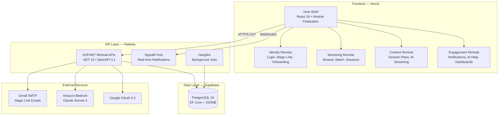
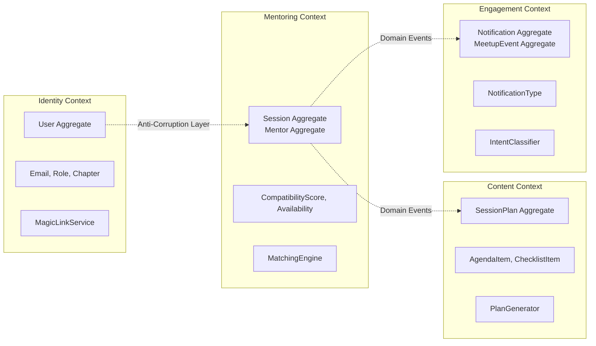

<!-- Badges -->


# 🎯 GuidedMentor

> AI-powered mentorship platform connecting AWS Community Builders across Australia with experienced professionals.

---

## STAR Objective

| | |
|---|---|
| **Situation** | AWS Community Builders and User Group members across Australia lack a structured mentoring platform. Experienced professionals want to give back, but there's no centralised system connecting them with mentees seeking guidance on certifications, career transitions, or skill development. |
| **Task** | Build a production-ready, full-stack AI-powered mentorship platform that matches mentees with compatible mentors using a rule-based algorithm, generates personalised session plans via Amazon Bedrock (Claude Sonnet 4), and delivers real-time notifications — all with $0/month hosting. |
| **Action** | Designed and implemented a DDD-driven platform with 4 bounded contexts, Clean Architecture (.NET 10 + ASP.NET Minimal APIs), React 19 micro-frontends (Module Federation), PostgreSQL (EF Core), SignalR real-time, Hangfire background jobs, and a comprehensive testing strategy including 35+ FsCheck property-based correctness properties. |
| **Result** | Production-ready platform with 487+ unit tests, 35 correctness properties (100 iterations each), architecture enforcement tests, WCAG 2.1 AA accessibility, mobile-first responsive design, and infrastructure-as-code ready for AWS migration — all running on Vercel + Railway + Supabase at $0/month. |

---

## 🏗️ Architecture



---

## 🛠️ Tech Stack

### Frontend

| Technology | Version | Purpose |
|---|---|---|
| React | 19.1 | UI framework with React Compiler auto-memoization |
| TypeScript | 5.7 | Type safety across entire frontend |
| TailwindCSS | 4.3 | Utility-first styling with dark glassmorphism theme |
| Vite | 6.3 | Fast dev server + production bundling |
| Module Federation | 1.3 | Micro-frontends per bounded context |
| TanStack Query | 5.80 | Server state management (no useEffect fetching) |
| React Router | 7.6 | Client-side routing |
| MSW | 2.14 | API mocking for offline-first development |

### Backend

| Technology | Version | Purpose |
|---|---|---|
| .NET | 10.0 | LTS runtime with Native AOT readiness |
| ASP.NET Minimal APIs | — | Thin HTTP layer, OpenAPI auto-generation |
| MediatR | — | CQRS command/query dispatching + pipeline behaviors |
| FluentValidation | — | Declarative input validation (auto-discovered) |
| Entity Framework Core | — | ORM with PostgreSQL provider |
| SignalR | — | WebSocket real-time notifications |
| Hangfire | — | Background job scheduling (token cleanup, analytics) |
| MailKit | — | Gmail SMTP email delivery |
| Polly v8 | — | Resilience (circuit breaker, retry, timeout) |
| Serilog | — | Structured logging with correlation IDs |

### Database & Auth

| Technology | Purpose |
|---|---|
| PostgreSQL 16 | Primary data store (JSONB, TEXT[], UUID PKs) |
| Supabase | Managed PostgreSQL hosting ($0 free tier) |
| Self-issued JWT | HMAC-SHA256, 15-min access + 7-day refresh tokens |
| Magic Links | Passwordless auth (UUID tokens, 10-min TTL, single-use) |
| Google OAuth 2.0 | Social identity federation |

### Testing

| Technology | Purpose |
|---|---|
| xUnit | Unit test framework |
| FsCheck | Property-based testing (35 correctness properties) |
| FluentAssertions | Readable assertions |
| NSubstitute | Interface mocking |
| Bogus | Realistic test data generation |
| NetArchTest | Clean Architecture enforcement |
| WebApplicationFactory | Integration tests with real HTTP pipeline |
| Vitest | Frontend test runner |
| React Testing Library | Component interaction testing |
| axe-core / jest-axe | Automated accessibility validation |
| Playwright | End-to-end user journey tests |
| OWASP ZAP | Dynamic Application Security Testing |
| Checkov + TFLint | Infrastructure-as-Code security + linting |

### CI/CD & Hosting

| Technology | Purpose |
|---|---|
| GitHub Actions | 9 workflows (build, test, security, deploy, drift) |
| Vercel | Frontend hosting ($0 free tier) |
| Railway | Backend hosting ($0 free tier) |
| Docker Compose | Local PostgreSQL development |
| Terraform | AWS infrastructure-as-code (future migration) |

### AI / ML

| Technology | Purpose |
|---|---|
| Amazon Bedrock | Claude Sonnet 4 direct inference |
| Microsoft.Extensions.AI | Abstracted IChatClient interface |
| Semantic Kernel | Prompt templating + plugins |
| Intent Classification | Rule-based FAQ routing (no RAG) |

---

## 📐 Domain-Driven Design

### Bounded Contexts



| Context | Owns | Why It Exists |
|---|---|---|
| **Identity** | Users, Roles, Auth Tokens, Onboarding | Isolates authentication, profile management, and role switching. Single source of truth for "who is this user?" |
| **Mentoring** | Mentors, Mentees, Sessions, Matching, Opportunities | Core domain — encapsulates the matching algorithm, session lifecycle, and mentor availability rules |
| **Content** | Session Plans, Agenda Items, AI Generation | Separates AI-generated content from session logistics. Can evolve independently (swap AI models, add templates) |
| **Engagement** | Notifications, Meetups, AI Help, Dashboards | Cross-cutting engagement features that don't belong in core domain but drive retention |

### Tactical Patterns

- **Entities**: User, Mentor, Mentee, Session, SessionPlan, Notification, MeetupEvent, Opportunity
- **Value Objects**: Email, CompatibilityScore, AgendaItem, ChecklistItem, NotificationType
- **Aggregates**: User (root), Session (root), SessionPlan (root), Notification (root)
- **Domain Events**: SessionAccepted, PlanGenerated, SessionCompleted, OpportunityPosted
- **Anti-Corruption Layers**: Cross-context calls go through interface abstractions — never direct entity references

---

## 🧅 Clean Architecture / Hexagonal

```
┌─────────────────────────────────────────────────┐
│                    API Layer                      │  ← HTTP endpoints, JSON serialization
│          (ASP.NET Minimal APIs + MediatR)         │
├─────────────────────────────────────────────────┤
│               Infrastructure Layer               │  ← EF Core, PostgreSQL, SignalR, MailKit
│      (Implements Application interfaces)         │
├─────────────────────────────────────────────────┤
│               Application Layer                  │  ← Commands, Queries, Handlers, Interfaces
│         (Orchestrates domain logic)              │
├─────────────────────────────────────────────────┤
│                 Domain Layer                      │  ← Entities, Value Objects, Domain Events
│           (Zero external dependencies)           │
└─────────────────────────────────────────────────┘
```

**Dependency Rule**: Inner layers never reference outer layers. Domain has zero NuGet dependencies. Application defines interfaces that Infrastructure implements.

**Infrastructure Swap Proof**: This project migrated from DynamoDB to PostgreSQL by replacing Infrastructure implementations — Domain and Application layers were untouched. The same pattern enables swapping to Aurora, adding Redis caching, or switching email providers without modifying business logic.

---

## ⚖️ SOLID Principles

| Principle | Implementation |
|---|---|
| **Single Responsibility** | One handler per command/query. One repository per aggregate. One validator per command. |
| **Open/Closed** | MediatR pipeline behaviors (Validation, Logging, Audit, Performance) extend cross-cutting concerns without modifying handlers. |
| **Liskov Substitution** | `IUserRepository` is fulfilled by `PostgresUserRepository`, `InMemoryUserRepository`, or `DynamoDbUserRepository` — all pass the same contract tests. |
| **Interface Segregation** | Focused interfaces: `IEmailSender`, `IMagicLinkService`, `IIntentClassifier`, `ISessionPlanGenerator`. No god-interfaces. |
| **Dependency Inversion** | All dependencies injected via DI. Application depends on `IUserRepository` (abstraction), never `PostgresUserRepository` (implementation). |

---

## 🔌 API-First Development

- **OpenAPI 3.1** spec auto-generated at `/openapi/v1.json`
- **Scalar** interactive API documentation at `/scalar/v1`
- **Contract-first workflow**: Define endpoint metadata → generate typed clients → implement handler
- **Versioned URLs**: All endpoints under `/v1/{resource}` (plural nouns)
- **Consistent error shape**: `{ statusCode, error, message, correlationId }`
- **Auth endpoints** (anonymous): `/v1/auth/magic-link`, `/v1/auth/verify-magic-link`, `/v1/auth/google`
- **Health check**: `/v1/health` (anonymous, returns dependency status)

---

## 🧩 Microservices Architecture

Each bounded context is structured as an independently deployable service (currently unified in a single host for cost efficiency):

```
src/Identity/       → GuidedMentor.Identity.{Api, Application, Domain, Infrastructure}
src/Mentoring/      → GuidedMentor.Mentoring.{Api, Application, Domain, Infrastructure}
src/Content/        → GuidedMentor.Content.{Api, Application, Domain, Infrastructure}
src/Engagement/     → GuidedMentor.Engagement.{Api, Application, Domain, Infrastructure}
src/Shared/         → SharedKernel, SharedInfrastructure, LocalDev, Observability
```

- **CQRS**: Commands mutate state, Queries read state — separated via MediatR `IRequest<T>`
- **Pipeline Behaviors**: ValidationBehavior → LoggingBehavior → AuditLoggingBehavior → PerformanceBehavior → Handler
- **Real-time**: SignalR hub at `/hubs/notifications` pushes events to connected clients
- **Background Jobs**: Hangfire processes token cleanup (every 5 min), analytics aggregation, expired opportunity archival

---

## 🧪 Testing Strategy

```
                    ┌───────────────┐
                    │   E2E Tests   │  Playwright (critical journeys)
                    ├───────────────┤
                 ┌──┤  Integration  │  WebApplicationFactory + PostgreSQL
                 │  ├───────────────┤
              ┌──┤  │  Architecture │  NetArchTest (layer rules, SOLID)
              │  │  ├───────────────┤
           ┌──┤  │  │   Property    │  FsCheck (35 correctness properties)
           │  │  │  ├───────────────┤
        ┌──┤  │  │  │  Unit Tests   │  xUnit + FluentAssertions + NSubstitute
        │  │  │  │  └───────────────┘
        └──┴──┴──┘
```

| Layer | Tools | Count | Threshold |
|---|---|---|---|
| Unit Tests | xUnit + FluentAssertions + NSubstitute + Bogus | 487+ | Domain ≥95%, Handlers ≥80% |
| Property-Based | FsCheck (100 iterations × 35 properties) | 3,500 executions | All must pass |
| Architecture | NetArchTest | — | Zero violations |
| Integration | WebApplicationFactory + Docker PostgreSQL | — | Critical paths |
| Frontend | Vitest + React Testing Library + axe-core | — | ≥70% + ≥90% a11y pass |
| E2E | Playwright | 3 journey specs | Auth, Mentoring, Session Plan |
| Security | OWASP ZAP + NuGet Audit + npm Audit | — | Zero high/critical vulns |
| Infrastructure | Checkov + TFLint | — | Zero failures |

---

## 🔒 Security (SSDLC)

| Control | Implementation |
|---|---|
| Passwordless Auth | Magic links only — no passwords stored anywhere in the system |
| Token Security | UUID (122-bit entropy), 10-min TTL, single-use, rate-limited (3/15min) |
| JWT | Self-issued HMAC-SHA256, 15-min access token, 7-day rotating refresh |
| Email Enumeration | All magic link requests return 200 regardless of email existence |
| Input Sanitization | Prompt injection prevention on AI inputs (Content + Engagement contexts) |
| Rate Limiting | API: 100 req/min, Magic links: 3/15min, AI Chat: 20/min |
| CORS | Configured for frontend origin only |
| Generic Errors | `{ statusCode, error, message, correlationId }` — no stack traces |
| Audit Logging | All state-changing commands logged via `IAuditableCommand` pipeline |
| Token Cleanup | Hangfire job purges expired tokens every 5 minutes |
| DAST | OWASP ZAP scanning in CI pipeline |
| Dependency Audit | NuGet + npm vulnerability scanning on every PR |
| IaC Security | Checkov scans Terraform for misconfigurations |
| Null Safety | `WarningsAsErrors` on all nullable reference type warnings |

---

## 🚀 CI/CD Pipeline

9 GitHub Actions workflows:

| Workflow | Trigger | What It Does |
|---|---|---|
| `ci-dotnet.yml` | PR/push to main (src/tests) | Build → Format check → xUnit → FsCheck → Coverage → NuGet audit |
| `ci-react.yml` | PR/push to main (frontend) | TypeScript → ESLint → Vitest → axe-core → npm audit |
| `security-scan.yml` | Weekly + manual | OWASP ZAP DAST + dependency vulnerability scan |
| `terraform-checks.yml` | PR (infrastructure/) | TFLint → Checkov → terraform validate → terraform plan |
| `terraform-drift.yml` | Nightly cron | Detects infrastructure drift against Terraform state |
| `e2e-tests.yml` | Post-deploy to staging | Playwright runs auth, mentoring, session-plan journeys |
| `deploy-backend.yml` | Push to main (src/) | Build → Docker → Push to Railway |
| `deploy-frontend.yml` | Push to main (frontend/) | Build → Deploy to Vercel |
| `deploy-infrastructure.yml` | Manual + main (infra/) | Terraform apply with approval gate |

---

## 🤖 Kiro Hooks & Steering

### Hooks (Automated Agent Actions)

| Hook | Event | Action |
|---|---|---|
| `review-architecture` | preToolUse (write) | Verify Clean Architecture compliance before file writes |
| `build-on-save` | fileEdited (*.cs) | `dotnet build` on backend file changes |
| `test-after-task` | postTaskExecution | Run relevant test suite after completing a task |
| `terraform-fmt` | fileEdited (*.tf) | `terraform fmt` on infrastructure changes |
| `validate-repository` | fileCreated (*Repository*) | Verify repository pattern compliance |
| `typecheck-frontend` | fileEdited (*.tsx) | TypeScript check on frontend changes |
| `verify-msw` | fileEdited (*/mocks/*) | Validate MSW handler shape matches API contracts |
| `validate-terraform` | fileEdited (*.tf) | `terraform validate` on save |

### Steering Files (Always-On Context)

| File | Scope | Purpose |
|---|---|---|
| `coding-standards.md` | Always | C#, React, Architecture, Testing conventions |
| `api-conventions.md` | Endpoints/*.cs | URL patterns, error shapes, auth extraction |
| `auth-patterns.md` | Auth/** | Magic link flow, JWT rules, rate limits |
| `postgres-conventions.md` | Repositories/** | EF Core patterns, column mapping, transactions |
| `design-system.md` | *.tsx | Color tokens, typography, component classes |
| `terraform-conventions.md` | *.tf | Module structure, naming, tagging, patterns |

### Skills (Scaffolding Automation)

`add-api-endpoint` · `add-background-job` · `add-dynamodb-repository` · `add-frontend-page` · `add-page-with-msw` · `add-signalr-notification` · `add-terraform-resource` · `deploy-dev` · `generate-runbook` · `prepare-pr` · `run-security-scan` · `run-test-suite`

---

## ♿ Accessibility (WCAG 2.1 AA)

- **Skip-nav link** as first focusable element on every page
- **Semantic HTML**: `<nav>`, `<main>`, `<section>`, `<article>` throughout
- **aria-labels** on all icon-only buttons
- **aria-live="polite"** for dynamic content (errors, loading states, notifications)
- **Focus trap** in modals with focus restore on close
- **Keyboard navigation** on all interactive elements
- **axe-core enforcement** in CI (≥90% pass rate)
- **prefers-reduced-motion** support — animations wrapped in media query checks
- **Touch targets** ≥44×44px on mobile
- **Safe area insets** for notched devices
- **Color contrast** ≥4.5:1 ratio (dark theme verified)

---

## 📱 Mobile-First Design

- **Responsive breakpoints**: 320px → 640px → 768px → 1024px → 1280px+
- **Hamburger navigation** on mobile (< 768px)
- **Full-screen chat overlay** for AI Help on mobile
- **Slide-up filter drawers** on Browse Mentors page
- **Responsive grids**: 1 column (mobile) → 2 columns (tablet) → 3 columns (desktop)
- **PWA meta tags** + `manifest.json` for add-to-homescreen
- **Glassmorphism cards** adapt padding/spacing per breakpoint

---

## 📊 Observability

| Layer | Tool | What It Provides |
|---|---|---|
| Logging | Serilog (structured JSON) | Correlation IDs, request/response logging, audit trails |
| Tracing | OpenTelemetry | Distributed traces (X-Ray compatible for AWS migration) |
| Metrics | Custom counters | Match scores, session completions, AI latency |
| Health | `/v1/health` endpoint | PostgreSQL, SignalR, Hangfire dependency checks |
| Background | Hangfire Dashboard | Job history, failures, retries |
| Alerting | CloudWatch Alarms (AWS) | Error rate, latency P99, DLQ depth (future) |

---

## ✨ Features

| Feature | Description | Context |
|---|---|---|
| Passwordless Auth | Magic link + Google OAuth, zero passwords stored | Identity |
| Role Toggle | Switch mentor ↔ mentee instantly, independent profiles | Identity |
| Multi-Step Onboarding | 4-step wizard with progress persistence | Identity |
| Mentor Browse | Browse all AU mentors with live compatibility scores | Mentoring |
| Matching Algorithm | Rule-based 0-100 score (skills, goals, availability, chapter) | Mentoring |
| Session Management | Request → Accept → Active → Complete lifecycle | Mentoring |
| Mutual Completion | Both parties confirm before session closes | Mentoring |
| Mentor Availability | Toggle available/unavailable without losing profile | Mentoring |
| AI Session Plans | Claude Sonnet 4 generates personalised 35-min agendas | Content |
| Checklist Tracking | Pre-work + follow-up task completion state | Content |
| AI Help Assistant | Floating chat with intent classification + FAQ routing | Engagement |
| Real-time Notifications | SignalR push (session updates, new opportunities, meetups) | Engagement |
| Opportunities Board | Jobs, workshops, events posted by mentors | Mentoring |
| Meetup Calendar | AWS User Group event scheduling per chapter | Engagement |
| Mentee Dashboard | Active sessions, recommendations, progress overview | Engagement |
| Mentor Dashboard | Pending requests, active mentees, schedule | Engagement |
| Admin Panel | User management, feature flags, maintenance mode | Identity |
| Seed Data Generator | Realistic demo data (13 users, sessions, notifications) | Shared |

---

## 📁 Project Structure

```
awsGuidedMentor/
├── .github/workflows/          # 9 CI/CD pipelines
├── .kiro/
│   ├── hooks/                  # 10 automated agent hooks
│   ├── skills/                 # 12 scaffolding skills
│   ├── steering/               # 6 convention files
│   └── specs/                  # Feature specifications
├── docs/
│   ├── compliance/             # Access control, AI risk, data retention
│   └── runbooks/               # Incident response, chaos testing
├── e2e/                        # Playwright E2E tests
├── frontend/
│   ├── host-shell/             # Module Federation host (routing, auth, nav)
│   ├── packages/               # Shared design system package
│   └── remotes/                # Micro-frontends (identity, mentoring, content, engagement)
├── infrastructure/
│   ├── modules/                # 9 Terraform modules (per context + cross-cutting)
│   ├── environments/           # dev.tfvars, staging.tfvars, prod.tfvars
│   └── chaos-testing/          # AWS FIS experiments
├── scripts/                    # Dev startup, DB init, seed data, deploy
├── src/
│   ├── Identity/               # Domain, Application, Infrastructure, Api
│   ├── Mentoring/              # Domain, Application, Infrastructure, Api
│   ├── Content/                # Domain, Application, Infrastructure, Api
│   ├── Engagement/             # Domain, Application, Infrastructure, Api
│   ├── BackgroundJobs/         # Hangfire job definitions
│   └── Shared/
│       ├── SharedKernel/       # Base entities, Result<T>, domain event interfaces
│       ├── SharedInfrastructure/  # EF DbContext, pipeline behaviors, security
│       ├── Observability/      # Serilog + OpenTelemetry configuration
│       └── LocalDev/           # Unified host for local development
├── tests/
│   ├── GuidedMentor.Identity.Tests/
│   ├── GuidedMentor.Mentoring.Tests/
│   ├── GuidedMentor.Content.Tests/
│   ├── GuidedMentor.Engagement.Tests/
│   ├── GuidedMentor.ArchitectureTests/      # NetArchTest Clean Architecture rules
│   ├── GuidedMentor.Integration.Tests/      # WebApplicationFactory + PostgreSQL
│   ├── GuidedMentor.SharedInfrastructure.Tests/
│   ├── GuidedMentor.SharedTestUtils/        # Bogus fakers, PBT base class
│   └── GuidedMentor.Tools.SeedData.Tests/
├── docker-compose.yml          # PostgreSQL 16 Alpine
├── Directory.Build.props       # .NET 10, nullable, analyzers
└── GuidedMentor.sln
```

---

## 🌐 Deployment Options

| Environment | Frontend | Backend | Database | Cost |
|---|---|---|---|---|
| **Local** | `npm run dev` (Vite :3000) | `dotnet run` (:5000) | Docker PostgreSQL (:5432) | $0 |
| **Production (Free)** | Vercel (free tier) | Railway (free tier) | Supabase PostgreSQL (free tier) | $0/month |
| **Production (AWS)** | CloudFront + S3 | Lambda + API Gateway | Aurora PostgreSQL Serverless v2 | ~$25/month |

Terraform modules are pre-built for the AWS deployment path — run `terraform apply` when ready to scale.

---

## 🚀 Getting Started

### Prerequisites

- [.NET 10 SDK](https://dotnet.microsoft.com/download)
- [Node.js 20+](https://nodejs.org/)
- [Docker Desktop](https://www.docker.com/products/docker-desktop/)
- [Git](https://git-scm.com/)

### Installation

```bash
# 1. Clone the repository
git clone https://github.com/your-org/guided-mentor.git
cd guided-mentor

# 2. Start PostgreSQL
docker compose up -d

# 3. Seed the database
docker exec -i guidedmentor-postgres psql -U dev -d guidedmentor < scripts/init-db.sql
docker exec -i guidedmentor-postgres psql -U dev -d guidedmentor < scripts/seed-demo-data.sql

# 4. Run the backend
dotnet run --project src/Shared/GuidedMentor.LocalDev

# 5. Run the frontend (new terminal)
cd frontend/host-shell
npm install
npm run dev
```

Or use the one-command startup:

```powershell
./scripts/dev-start.ps1
```

### Verify

| Service | URL |
|---|---|
| Frontend | http://localhost:3000 |
| API | http://localhost:5000 |
| API Docs (Scalar) | http://localhost:5000/scalar/v1 |
| OpenAPI Spec | http://localhost:5000/openapi/v1.json |
| PostgreSQL | localhost:5432 (dev/dev) |

### Run Tests

```bash
# Backend unit + property tests
dotnet test GuidedMentor.sln

# Property-based tests only
dotnet test --filter "Category=Property"

# Frontend tests
cd frontend && npm test

# E2E tests
cd e2e && npx playwright test

# Architecture tests
dotnet test tests/GuidedMentor.ArchitectureTests
```

---

## 🧑‍💻 Demo Credentials

Use the Quick Login feature on the login page (dev mode only):

| Name | Email | Role | Chapter |
|---|---|---|---|
| Sarah Chen | sarah.chen@example.com | Mentor | Sydney |
| James Nguyen | james.nguyen@example.com | Mentor | Melbourne |
| Priya Sharma | priya.sharma@example.com | Mentor | Brisbane |
| David Kim | david.kim@example.com | Mentor | Perth |
| Emma Wilson | emma.wilson@example.com | Mentor | Adelaide |
| Alex Patel | alex.patel@example.com | Mentee | Sydney |
| Mia Johnson | mia.johnson@example.com | Mentee | Melbourne |
| Liam Brown | liam.brown@example.com | Mentee | Brisbane |

In local dev, the magic link token is logged to console — no real email required.

---

## 📜 License

MIT © 2025 GuidedMentor Contributors
